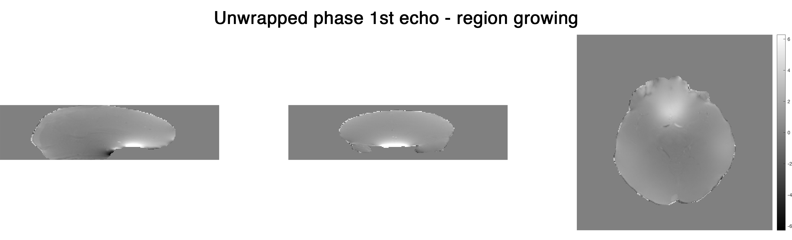
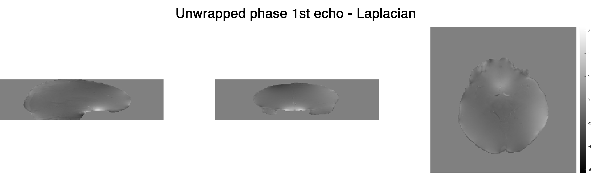
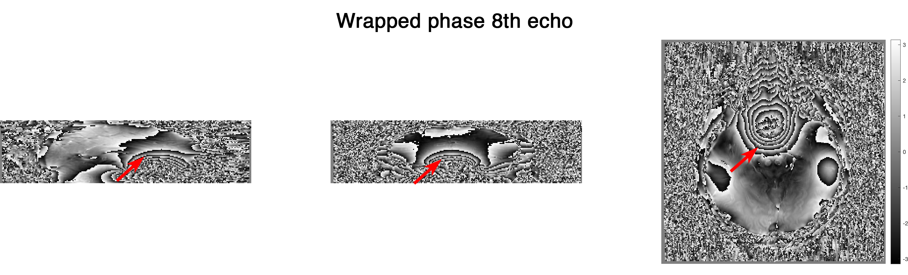
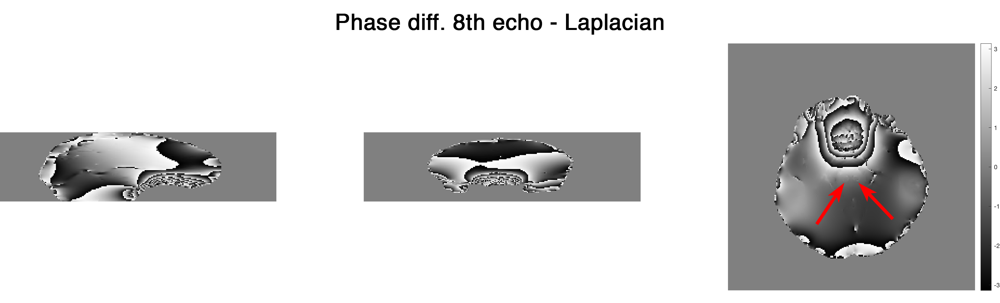

Choosing a right phase unwrapping method for your data
======================================================

SEPIA provides a range of phase unwrapping methods from the supported toolboxes. In this demonstration, I will try to show the differences between two main phase unwrapping methods: (1) region growing and (2) Laplacian-based - an important processing step to reveal the (true) phase of MRI gradient echo data for QSM processing.

Data preparation
----------------

The *in vivo* test data was downloaded from `Cornell MRI lab <http://pre.weill.cornell.edu/mri/pages/qsm.html>`_ and converted to NIfTI format by `dicm2nii <https://github.com/xiangruili/dicm2nii>`_.  
FSL's BET was used to extract the brain mask to improve the processing result.

Processing
----------

Test 1: Unwrapping the phase with a small amount of wrapping effect  
^^^^^^^^^^^^^^^^^^^^^^^^^^^^^^^^^^^^^^^^^^^^^^^^^^^^^^^^^^^^^^^^^^^

To begin with, let have a look of the phase image from the 1st echo GRE data (TE=3.6ms)  

.. image:: images/phase_unwrap/wrap-phase_e-1.png

Under a linear model assumption the phase of each voxel over time can be expressed by the following equation:  

.. math::

   phase = angular frequency \times time [1]

However, this phase value is constrained in the interval of [-pi,pi) in the MRI phase data. Any value that is outside of this interval will be wrapped back to this interval (see red arrows). For QSM processing, it is important to unwrap the phase such that the true frequency shift inside the voxel can be computed using the above equation.

To unwrap the phase images, there are two main methods being used: (1) **region growing** and (2) **Laplacian operator**. In SEPIA, you can use the following commands to access the methods:  

.. code-block:: matlab

    % region growing  
    unwrappedPhase = UnwrapPhaseMacro(wrappedPhase,matrixSize,voxelSize,'method','rg','magn',magn,'mask',mask);  
    % Laplacian  
    unwrappedPhase = UnwrapPhaseMacro(wrappedPhase,matrixSize,voxelSize,'method','laplacian');
    unwrappedPhase = UnwrapPhaseMacro(wrappedPhase,matrixSize,voxelSize,'method','laplacian_stisuite');  

Region growing   
++++++++++++++

Laplacian  
+++++++++

Both methods can unwrap the 1st echo phase successfully, but they show different brightness under the same dynamic range (-2pi,2pi). **Where does this difference come from?**  

Let's compare the unwrapped phase with the original wrapped phase. In Matlab this can be done by:  
``phase_residual = angle(exp(1i*wrappedPhase) .* conj(exp(1i*unwrappedPhase)));``  

Here are the residual phase maps form  

Region growing  
++++++++++++++

.. image:: images/phase_unwrap/phase-diff_rg_e-1.png

The residual map shows 0s everywhere. This means that the unwrapped phase image is just a summation of 2xpixN (N is an integer)  of the original wrapped phase map (which is unwrapped in this case).  

Laplacian  
+++++++++

.. image:: images/phase_unwrap/phase-diff_laplacian_e-1.png

This shows that the unwrapped phase from the Laplacian method is not an exact summation of 2xpixN to the original phase. It is due to the fact that the Laplacian operator removes some of the harmonic field components from the original phase image (which is the slowly-varying field in this image). Since the harmonic field will also be removed from later on processing steps in QSM processing, Laplacian unwrapping is still a good method to unwrap the signal phase in this case (we didn't see any brain structure in the residual map except veins). 

Test 2: Unwrapping the phase with a large amount of wrapping effect  
^^^^^^^^^^^^^^^^^^^^^^^^^^^^^^^^^^^^^^^^^^^^^^^^^^^^^^^^^^^^^^^^^^^

From Eq.1, we can see that phase accumulated with an increase of time. Therefore when we look at the later echo(es), we can see more phase wrapping appeared and here is an example at the 8th echo (TE=45ms) of the testing data  

We can use the same unwrapping methods as we did before and look at the results again:  

Region growing
++++++++++++++

.. image:: images/phase_unwrap/unwrap-phase_rg_e-8.png

The region growing method can still produce a reliable result in most of the brain regions even in the presence of a large wrapping effect. Yet, unwrapping errors can be observed in the posterior blood vessel and in the temporal lobe (see arrows). It is apparently caused by the relatively large susceptibility field together with the low SNR in these regions.  

Laplacian  
+++++++++

.. image:: images/phase_unwrap/unwrap-phase_laplacian_e-8.png

The unwrapped phase is smooth from the Laplacian method but is it truly better than that of the region growing method? Let's compare the unwrapped phase with the original phase to see more detail!

Here are the residual phase maps form  

Region growing  
++++++++++++++

.. image:: images/phase_unwrap/phase-diff_rg_e-8.png

Once again, the residual map shows 0s everywhere, suggesting that the unwrapped phase is a summation of 2xpixN of the original phase even though it didn't unwrap the phase correctly in some regions.

Laplacian
+++++++++

More harmonic components were removed compared to the case of 1st echo. In addition, we can start seeing brain structures (arrows indicating the red nuclei) in the residual phase which is not optimal for QSM. Nonetheless, the incorrect unwrapped phase generated by region growing method can actually create more problems in later QSM processing.  

Summary  
^^^^^^^
Region growing method should be used in the first attempt to unwrap the raw phase image. It is reliable for a small amount of wrapped effect and represents the true phase value (for successful unwrapping). Laplacian method is very robust to unwrap a large amount of phase wrapping by trading a small degree of accuracy in the unwrapping results.