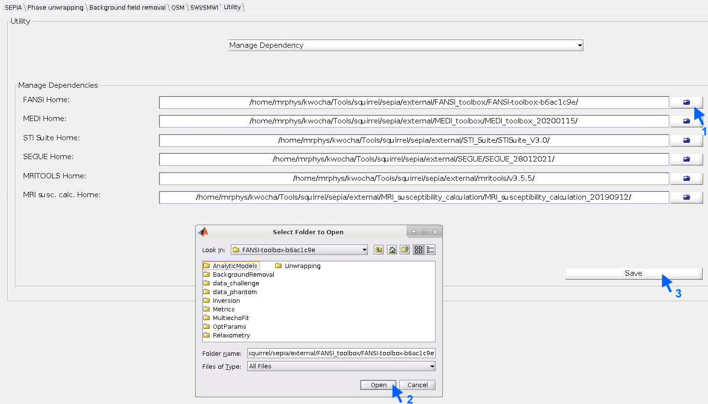

.. _gettingstart-installation:

Installation/Setp up
====================

Prerequisite  
------------

To support the fully functionality of **SEPIA**, the following external libraries, which are freely available for academic purposes, are required. You can download these toolboxes/libraries using the following links:

- `MEDI toolbox (updated Jan 15, 2020) <http://pre.weill.cornell.edu/mri/pages/qsm.html>`_  
- `STI Suite (v3.0) <https://chunleiliulab.github.io/software.html>`_  
- `FANSI toolbox (v3.0, released on 2021.10.15, i.e., commit b6ac1c9e) <https://gitlab.com/cmilovic/FANSI-toolbox/-/tree/b6ac1c9ea03380722ebe25a6dbef33fff4ea3700>`_  
- `SEGUE (accessed 12 September 2019) <https://xip.uclb.com/i/software/SEGUE.html>`_
- `MRI susceptibility calculation methods (accessed 12 September 2019) <https://xip.uclb.com/product/mri_qsm_tkd>`_
- `mritools (v3.5.5) <https://github.com/korbinian90/CompileMRI.jl/releases/tag/v3.5.5>`_

If you encounter any difficulty to download these toolboxes please let us know by opening a new issue in the `GitHub page <https://github.com/kschan0214/sepia/issues>`_.  

Installation of SEPIA
---------------------

Once you have all the toolboxes in place, you have to add the directory containing `sepia.m <https://github.com/kschan0214/sepia/blob/master/sepia.m>`_, i.e. the SEPIA HOME directory, to your MATLAB PATH

This can be done by:
'Set Path' -> 'Add Folder' -> /your/sepia/directory/ -> 'Save'  

.. warning::
    To ensure only the selected algorithm is used for the QSM processing, please do not manually add the paths to the external toolboxes you want to run in SEPIA to the Matlab PATH, the `sepia_addpath` function will do the job for you:).)  

or

with MATLAB's command: ``addpath('/your/sepia/directory')``  

Managing external dependency 
----------------------------
SEPIA is a pipeline processing tool focusing on integrating various tools in a single platform. Although SEPIA does provide QSM methods for some basic processing, the majority of the methods supported by SEPIA are from external tool. Users have to download these tools from the URLs provided aboved before they can be run in SEPIA. Once you have all the tools available in your computer, you can use the following options to manage these tools in the SEPIA environment.

Managing external dependency via GUI
^^^^^^^^^^^^^^^^^^^^^^^^^^^^^^^^^^^^

You have to specify the directory of each toolbox. From SEPIA v1.0, this can be done on the SEPIA's GUI: simply initialises the GUI using command ``sepia``, this should start the GUI. For the first time, you will see some warning messages regarding missing dependencies. Ignore those messages for now.

Navigates to the 'Utility' tab, and select 'Manage Dependency':

1. Use the icon to select the top folder of the tool 
2. Click 'Open' to select the folder 
3. Click 'Save' once you finish adding all dependencies

Now, restart the SEPIA's GUI by closing the window and re-open it using the ``sepia`` command in Matlab. You should recieve no more warning messages now if you provide all the required dependencies.

Managing external dependency directly on SpecifyToolboxesDirectory.m
^^^^^^^^^^^^^^^^^^^^^^^^^^^^^^^^^^^^^^^^^^^^^^^^^^^^^^^^^^^^^^^^^^^^ 

Alternatively, the traditional way of manging dependency in `SpecifyToolboxesDirectory.m <https://github.com/kschan0214/sepia/blob/master/SpecifyToolboxesDirectory.m>`_ is still feasible:

.. code-block:: matlab

   MEDI_HOME = '/path/to/MEDI/toolbox/';  
   STISuite_HOME = '/path/to/STISuite/toolbox/';   
   FANSI_HOME = '/path/to/FANSI/toolbox/'; 
   SEGUE_HOME = '/path/to/SEGUE/library/;'
   MRISC_HOME = '/path/to/MRI_susceptibility_calculation/library/;'
   MRITOOLS_HOME = '/path/to/MRITOOLS/library/;'
 
.. warning::
    The variable names of the toolboxes' paths are changed from '_dir' to '_HOME' from v0.8. Please update your ``SpecifyToolboxesDirectory.m`` file accordingly to avoid error.

.. warning::
    The variable 'ROMEO_HOME' is changed to 'MRITOOLS_HOME' in v1.1.1. Please update your ``SpecifyToolboxesDirectory.m`` file accordingly to avoid error. You can also specify the path to the previous ROMEO executable (but CLEAR-SWI might not work in this case).

For example, I have all my external toolboxes stored under the SEPIA home directory. Additionally, for each toolbox, I have different copies representing different versions when they were published  

.. image:: images/show_how_to_specify_path.png

and here is an example of how is my SpecifyToolboxesDirectory.m defined:

.. code-block:: matlab

    % 1. sepcify the toolbox version you want to run
    MEDI_version        = 'MEDI_toolbox_20200115';
    FANSI_version       = 'FANSI-toolbox-77023b65';
    STISuite_version    = 'STISuite_V3.0';
    SEGUE_version       = 'SEGUE_28012021';
    MRISC_version       = 'MRI_susceptibility_calculation_20190912';
    MRITOOLS_version    = 'v3.5.5';

    % 2. get the Sepia HOME directory from this script
    fullName        = mfilename('fullpath');
    SEPIA_HOME      = fileparts(fullName);

    % 3. specify the top level of external dependency directory
    external_dir    = [SEPIA_HOME filesep 'external' filesep];

    % 4. specify the parent directory of each toolbox
    MEDI_dir       = [external_dir 'MEDI_toolbox' filesep];
    FANSI_dir      = [external_dir 'FANSI_toolbox' filesep];
    STISuite_dir   = [external_dir 'STI_Suite' filesep];
    SEGUE_dir      = [external_dir 'SEGUE' filesep];
    MRISC_dir      = [external_dir 'MRI_susceptibility_calculation' filesep];
    MRITOOLS_dir   = [external_dir 'MRITOOLS' filesep];

    % 5. sepcify the final destination of each toolbox you want to run in Sepia
    MEDI_HOME        = [MEDI_dir        MEDI_version        filesep];
    FANSI_HOME       = [FANSI_dir       FANSI_version       filesep];
    STISuite_HOME    = [STISuite_dir    STISuite_version    filesep];
    SEGUE_HOME       = [SEGUE_dir       SEGUE_version       filesep];
    MRISC_HOME       = [MRISC_dir       MRISC_version       filesep];
    MRITOOLS_HOME    = [MRITOOLS_dir    MRITOOLS_version    filesep];

**IMPORTANT: Please do not modify the original structure of these toolboxes, SEPIA searches the path of the related functions based on the original folder structure.**   

Now you can start the GUI by entering ``sepia`` in the MATLAB's command window.

Setup deep learning tools for SEPIA
-----------------------------------
Starting from v1.1.2, several deep learning methods for QSM processing are (experimentally) supported in SEPIA. Please refer to the individual algorithm pages on :ref:`method_QSM_algorithm_all` and :ref:`method_BFR_algorithm_all` for more infomation on setting up these methods in SEPIA.

Compatibility
-------------

SEPIA is developed mainly in MATLAB R2016b on Linux and macOS. In general, all methods should compatible with earlier MATLAB versions up to R2014b. Most of the methods should also compatible with MATLAB R2017a or later, and other OS, except you might encounter issue with the following functions/algorithms

- Laplacian Boundary Value (LBV) for background field removal
    .. note::
        If the LBV algorithm doesn't work on your operating system, you can go to the '_LBV' directory of the MEDI toolbox and try the following command in the Matlab command window to re-compile the library: ``mex mexMGv6.cpp``

- Graphcut for phase unwrapping

- SEPIA v1.0 supports both FANSI v1.0 and v3.0. However, compartibility to FANSI v2.0 (commit 77023b65, released on 2020.07.27) is not yet tested!
