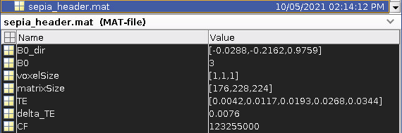

.. _gettingstart-sepia-header:
.. _sepia-header:
.. role::  raw-html(raw)
    :format: html

SEPIA header
============

To obtain a frequency shift map or magnetic susceptibility map with correct units, it is important to inform the corresponding algorithm(s) with information including the main magnetic field strength (B0) of the scanner, the main magnetic field direction with respect to the field of view (FOV) and the echo times (TEs) used in the acquisition. Unfortunately, such information may not be (directly) available in the NIfTI header after the DICOM conversion. Therefore, an additional file is needed to provide this information in **SEPIA** which is called SEPIA header.

SEPIA header is a MAT-file (.mat) that stores some important header information of the input data. The following example shows the variables (case-sensitive) that must be stored in the header file:

.. code-block:: matlab

	B0 = 3;			% magnetic field strength, in Tesla
	B0_dir = [0;0;1];	% main magnetic field direction, [x,y,z]
	CF = 3*42.58*1e6;	% imaging frequency, in Hz (B0*gyromagnetic_ratio)
	TE = [te1,te2,te3,te4]; % echo time for each GRE image, in second 
	delta_TE = te2-te1;	% echo spacing, in second
	matrixSize = [64,64,64]	% image matrix size
	voxelSize = [1,1,1]	% spatial resolution of the data, in mm

Example of 5-echo 3D data:

You can create this file manually in Matlab. Alternatively, you can use the Utility standalone application to generate the file. Please visit the corresponding `wiki page <https://github.com/kschan0214/sepia/wiki/Get-header-info>`_ for more information about how to generate the header file. 

.. note:: Starting from SEPIA v1.0, only variables 'B0' and 'TE' are essential in the SEPIA header file. The rest of the parameters can be read from the NIfTI file directly if dcm2niix (and other supported DICOM-to-NIfTI conversion tools) is used.