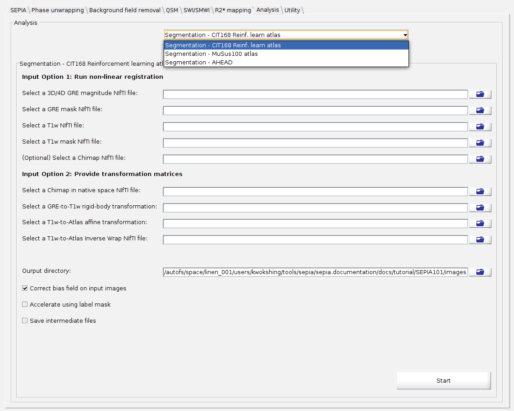

.. _gui-Analysis-standalone:
.. _Analysis-standalone:
.. role::  raw-html(raw)
    :format: html

Analysis (Subcortical Structure Segmentation)
================================================

What is the Analysis tab?
----------------------------

The Analysis tab brings atlas-based subcortical structure labels (e.g. globus pallidus, putamen, subthalamic nucleus) into your own GRE/QSM space, using non-linear registration powered by `ANTs <https://github.com/ANTsX/ANTs>`_.

.. warning::
  Before using this tab, 'ANTS_HOME' must be set up (either in ``SpecifyToolboxesDirectory.m`` or via the Manage Dependency tool in the Utility tab) and the atlas of your choice must be downloaded. See :ref:`segmentation-in-sepia` for detailed setup instructions.

Structure of the application
------------------------------

Unlike the other standalones, the Analysis tab does not share the universal I/O panel or Start button - it consists of a single panel:

- Analysis panel, which lets you pick a segmentation atlas; each atlas has its own dedicated input/output fields, options and Start button.

Analysis panel
^^^^^^^^^^^^^^^^

- Method

  Select one of the three supported atlases:

  +-------------------------------------------+-----------------------------------------+
  | Method                                    | Description                             |
  +===========================================+=========================================+
  | Segmentation - CIT168 Reinf. learn. atlas | See :ref:`method-segmentation-cit168rl` |
  +-------------------------------------------+-----------------------------------------+
  | Segmentation - MuSus100 atlas             | See :ref:`method-segmentation-musus100` |
  +-------------------------------------------+-----------------------------------------+
  | Segmentation - AHEAD                      | See :ref:`method-segmentation-ahead`    |
  +-------------------------------------------+-----------------------------------------+

  Each atlas panel accepts input in one of two ways:

  **Input Option 1: Run non-linear registration**

  - Select a 3D/4D GRE magnitude NIfTI file
  - Select a GRE mask NIfTI file
  - Select a T1w NIfTI file
  - Select a T1w mask NIfTI file
  - (Optional) Select a Chimap NIfTI file

  This runs the full registration pipeline (GRE-to-T1w rigid-body, then T1w-to-atlas non-linear registration) to bring the atlas labels into your GRE space.

  **Input Option 2: Provide transformation matrices**

  - Select a Chimap in native space NIfTI file
  - Select a GRE-to-T1w rigid-body transformation
  - Select a T1w-to-Atlas affine transformation
  - Select a T1w-to-Atlas Inverse Wrap NIfTI file

  Use this option if you already have the transformation matrices from a previous ANTs run (e.g. from a prior segmentation using the same subject).

  .. note::
    If a GRE mask is provided (Option 1), the panel uses Option 1; otherwise it falls back to Option 2's fields.

  - Output directory

    Directory where the segmentation labels and (optionally) intermediate files will be saved. Defaults to the current working directory if left empty.

  - Correct bias field on input images

    If enabled, applies N4 bias field correction to the input images before registration.

  - Automatic contrast matching

    .. note::
      Available for the 'MuSus100' and 'AHEAD' atlases only.

    If enabled, matches the hybrid image contrast to the atlas template before registration.

  - Downsample AHEAD atlas, resolution (mm)

    .. note::
      Available for the 'AHEAD' atlas only.

    If enabled, downsamples the (high-resolution) AHEAD atlas to the specified isotropic resolution before applying it, which can substantially speed up registration at the cost of some label precision.

  - Accelerate using label mask

    .. warning::
      Use with caution! The result is likely different from whole-brain registration.

    If enabled, speeds up registration by only considering the region around the atlas labels rather than the whole brain.

  - Save intermediate files

    If enabled, keeps all the intermediate files generated during registration (e.g. the individual ANTs transformation steps) rather than removing them once segmentation is complete.

  - Start

    Runs the registration/segmentation pipeline for the selected atlas using the settings above.
