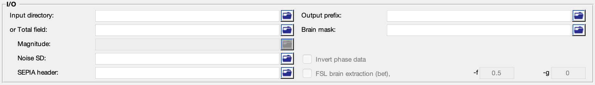
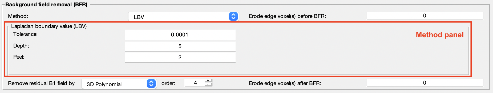

.. _gui-Background-field-removal-standalone:
.. _Background-field-removal-standalone:
.. role::  raw-html(raw)
    :format: html

Background Magnetic Field Removal Standalone
============================================

Background field removal in QSM
-------------------------------

The phase we measured in a GRE acquisition is affected by not only the brain tissue but also sources like B0 inhomogeneity and air sinus. In order to compute the susceptibility sources only contributed by the brain tissue, it is important to remove all the non-local field effect. Fortunately, the characteristic of the local field is different from that of the non-local field, it is possible to separate the two fields from the unwrapped total field. This standalone application is designed to solve the field separation problem.

**Caution**: It is crucial that the background field contribution is removed accurately in this stage. Otherwise, the remaining field due to background sources will be treated as part of the local field, degrading the quality of QSM result.

Structure of the application
----------------------------

This application consists of two panels:

- I/O panel, and
- Background field removal panel.

Description of each panel is given below:

I/O panel
^^^^^^^^^

The I/O panel is responsible for data input/output and data processing that is not specific to QSM.

- Data input  

  There are two pathways to specify input in this application:

  1. Specify a directory that contains all essential data. 

    The essential data are:

    +--------------------+-----------------------------------------------------------------------------------------------------------------------+
    | Data               | Description                                                                                                           |
    +====================+=======================================================================================================================+
    | Total field        | 3D total field map in Hz ([x,y,slice]), must contain 'total-field' in the filename, e.g. *total-field.nii.gz*         |
    +--------------------+-----------------------------------------------------------------------------------------------------------------------+ 
    | Header             | see :ref:`sepia-header` for more information, must contain 'header' in the filename, e.g. *header.mat*                |
    +--------------------+-----------------------------------------------------------------------------------------------------------------------+ 
    | Mask               | 3D signal mask, if provided, must contain string 'mask' in the filename, e.g. *mask.nii.gz*                           |
    +--------------------+-----------------------------------------------------------------------------------------------------------------------+ 

    .. warning::
      Please make sure the filenames follow the above rules and no other files in the directory sharing the same string labels (i.e. 'total-field', 'header' and 'mask').

  2. Specify the required data separately using the GUI buttons. 

    .. note::
      The 'Noise SD' input is an optional input for 'PDF' algorithm. You can specify a 3D data that provides the noise standard deviation of the original phase data (e.g. *noise-sd.nii.gz* derived from phase unwarpping step in SEPIA).

- Output prefix

  By default, the output files generated by SEPIA will be stored in a directory named '*output*' under the directory of the input files (i.e. '_/your/input/directory/output/_'). The prefix of the output filename is '*Sepia*'. You can change the default output directory and prefix according to your preference. If the output directory does not exist, the application will create the directory.  

  .. note::
    Make sure the 'Output prefix' field contains a full path of the output directory and a filename prefix.
  
- Brain mask  

  You can specify a signal (brain) mask NIfTI file. 
  
  .. note::
    A mask **must** be provided (either in the input directory or specified) in this standalone.

Background field removal panel
^^^^^^^^^^^^^^^^^^^^^^^^^^^^^^

- Method

  Select a background field removal method. The method parameters will be displayed on the method panel.

- Remove residual B1 field by

  Option to remove potential field contributions originated from B1 by polynomial fitting or spherical harmonic fit.

- Erode edge voxel(s)  

  Further remove the edge voxels from the brain mask. Useful when the local field is not reliably estimated on the brain edges. This operation is performed **prior** the 'Remove potenital B1 residual phase' operation (if selected).

Others
^^^^^^

.. image:: images/start_button_anno.png

- Load config

  Import the method related settings specified in the SEPIA-generated config file to the SEPIA GUI. **NO** modification will be made in the I/O panel.

- Start

  Generate a SEPIA config file that contains all user-defined methods and parameters for QSM processing based on the setting in the GUI. SEPIA will run the config file immediately once it is generated.
