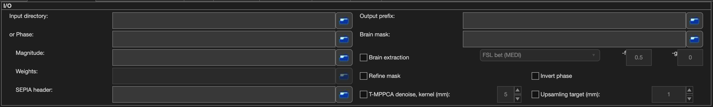
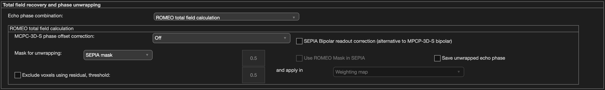

.. _gui-Phase-unwrapping-standalone:
.. _Phase-unwrapping-standalone:
.. role::  raw-html(raw)
    :format: html

Phase Unwarpping Standalone
===========================

Phase unwrapping in QSM
-----------------------

Phase wrapping occurs when continuous phase information is sampled in a discrete wrapped phase. The measured phase accumulation larger than one phase cycle is wrapped into the interval [-:math:`\pi`, :math:`\pi`), causing the discontinuity in the phase data. To recover the true phase values, one must solve this ambiguity problem by adding the correct integer number of phase cycles to the phase data in order to recover the true phase revolution. 

The objective of this standalone application is to recover the actual, total phase shift of the acquired data.

.. note::
  Since v1.3.0, the GUI's default phase unwrapping method is toolbox-availability-aware: it follows a consensus-informed priority chain and automatically selects the highest-priority method whose required toolbox is actually installed, rather than always defaulting to the same method.

Structure of the application
----------------------------

This standalone consists of two panels:

- I/O panel, and
- Total field recovery and phase unwrapping panel.

Description of each panel is given below:

I/O panel
^^^^^^^^^

The I/O panel is responsible for data input/output and data processing that is not specific to QSM.

- Data input  

  There are two pathways to specify input in this application:

  1. Specify a directory that contains all essential data. 

    The essential data are:

    +--------------------+--------------------------------------------------------------------------------------------------------------------------+
    | Data               | Description                                                                                                              |
    +====================+==========================================================================================================================+
    | Phase              | 3D/4D phase data ([x,y,slice,time]), must contain 'ph' in the filename, e.g. *phase.nii.gz* or *ph.nii.gz*,              |
    +--------------------+--------------------------------------------------------------------------------------------------------------------------+
    | Magnitude          | 3D/4D magnitude data ([x,y,slice,time]), must contain 'mag' in the filename, e.g. *magn.nii.gz* or *mag.nii.gz*;         |
    +--------------------+--------------------------------------------------------------------------------------------------------------------------+ 
    | Header             | see :ref:`sepia-header` for more information, must contain 'header' in the filename, e.g. *header.mat*                   |
    +--------------------+--------------------------------------------------------------------------------------------------------------------------+ 
    | Mask               | (optional) 3D signal mask, if provided, must contain string 'mask' in the filename, e.g. *mask.nii.gz*                   |
    +--------------------+--------------------------------------------------------------------------------------------------------------------------+ 

    .. warning::
      Please make sure the filenames follow the above rules, or the BIDS specification (see **Data Input** in :ref:`Data-preparation`), and no other files in the directory sharing the same string labels (i.e. 'ph', 'mag', 'header' and 'mask').

  2. Specify the required data separately using the GUI buttons. 

- Output prefix

  By default, the output files generated by SEPIA will be stored in a directory named '*output*' under the directory of the input files (i.e. '_/your/input/directory/output/_'). The prefix of the output filename is '*Sepia*'. You can change the default output directory and prefix according to your preference. If the output directory does not exist, the application will create the directory.  

  .. note::
    Make sure the 'Output prefix' field contains a full path of the output directory and a filename prefix.
  
- Brain mask

  You can optionally specify a signal (brain) mask NIfTI file. If this input is empty and no mask is found in the input directory, SEPIA will automatically compute a brain mask using the method selected in 'Brain extraction' below.

- Brain extraction

  Since v1.3.0, brain mask computation is no longer limited to FSL's BET. A method dropdown lets you choose between:

  +--------------------------+--------------------------------------------------------------------------------------------+
  | Method                   | Description                                                                                |
  +==========================+============================================================================================+
  | FSL bet (MEDI)           | Matlab implementation of FSL's BET provided with the MEDI toolbox, with fractional         |
  |                          | intensity threshold (-f) and vertical gradient in fractional intensity threshold (-g)      |
  |                          | options. More information can be found in `BET/UserGuide                                   |
  |                          | <https://fsl.fmrib.ox.ac.uk/fsl/fslwiki/BET/UserGuide>`_.                                  |
  +--------------------------+--------------------------------------------------------------------------------------------+
  | Otsu thresholding        | Multilevel Otsu's-method thresholding of the magnitude image.                              |
  +--------------------------+--------------------------------------------------------------------------------------------+
  | SynthStrip               | Runs FreeSurfer's ``mri_synthstrip`` on the magnitude image.                               |
  +--------------------------+--------------------------------------------------------------------------------------------+
  | SynthStrip (no CSF)      | Same as above, with the ``--no-csf`` flag.                                                 |
  +--------------------------+--------------------------------------------------------------------------------------------+

  .. note::
    The two SynthStrip options are only shown in the dropdown if the ``mri_synthstrip`` command is found on the system, i.e. FreeSurfer's SynthStrip must already be installed and available in the ``PATH`` environment variable.

- Refine mask (Multi-echo data only)

  If enabled, a R2* map will be computed and used to threshold out high R2* voxels on the edges of the brain mask. Since v1.3.0 this is handled by a generalised mask refinement pipeline.

- Invert phase data

  Checking this option will invert the contrast of the SEPIA output frequency and QSM maps. Mathematically it inverse the signal phase by computing the signal conjugate. It is useful if you want to have specific colour scheme for QSM (e.g. dark colour for paramagnetic susceptibility).

- T-MPPCA denoise, kernel (mm)

  .. note::
    New in v1.3.0.

  If enabled, the magnitude and phase data are denoised using Tensor-MP-PCA prior to any other processing, using the specified isotropic sliding-window kernel size (in mm; default 5 mm). The required external toolbox is downloaded automatically on first use. Denoising can take a noticeable amount of time and its runtime depends on the data size and kernel size chosen.

- Upsampling target (mm)

  .. note::
    New in v1.3.0.

  If enabled, the magnitude and phase data are upsampled to the specified isotropic target resolution (in mm) using k-space zero-filling prior to processing. All subsequent outputs, including the unwrapped field map, will be at the upsampled resolution.

Total field recovery and phase unwrapping panel
^^^^^^^^^^^^^^^^^^^^^^^^^^^^^^^^^^^^^^^^^^^^^^^

- Echo phase combination  

  Select a method for temporal phase unwrapping with multi-echo data.

  .. note::
    If the number of echoes is less than 3. 'Optimum weights' method will be automatically used.

- Phase unwrapping

  Select a method for spatial phase unwrapping.

  .. warning::
    The '3D best path' method might not work in most operating systems.

  .. note::
    New in v1.3.0: a 'None' option is available for when only field mapping (and not phase unwrapping) is required, e.g. for functional QSM.
		
- Bipolar readout correction

  Correct the phase inconsistency between odd and even echoes, and a gradient-like (should be only in the readout direction) magnetic field contributed from eddy current due to bipolar readout.

- Save unwrapped echo phase
  
  Export all unwrapped echo phase images as NIfTI.
  
- Exclude voxels using residual, threshold:  

  Exclude voxels that have high relative residual based on a single compartment model fitting. The output data with suffix '*relative-residual.nii.gz* will be used for thresholding. For voxels that have intensity **higher** than the threshold will be **excluded** from subsequent processing. Two methods are supported to exclude those voxels: 

  1. 'Weighting map': Please see :ref: `weightings-in-sepia`` Section **Further modulation on the weighting maps**
  2. 'Brain mask': the excluded voxels will be excluded in the signal mask in the subsequent processing. This will affect both background field removal and QSM dipole inversion results.

  Only available for quantitative methods (i.e. '3D best path', 'Region growing (MEDI)', 'SEGUE' and 'ROMEO') and 'Graphcut' method. 

Others
^^^^^^

.. image:: images/start_button_anno.png

- Load config

  Import the method related settings specified in the SEPIA-generated config file to the SEPIA GUI. **NO** modification will be made in the I/O panel.

- Start

  Generate a SEPIA config file that contains all user-defined methods and parameters for QSM processing based on the setting in the GUI. SEPIA will run the config file immediately once it is generated.
