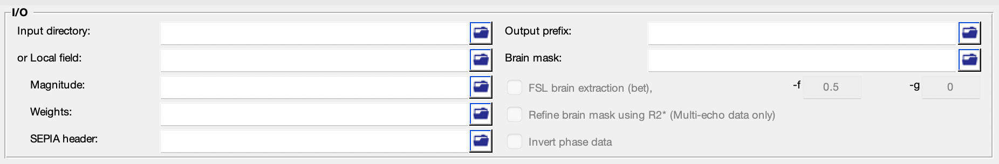

.. _gui-QSM-standalone:
.. _QSM-standalone:
.. role::  raw-html(raw)
    :format: html

QSM Standalone
==============

How can we map the magnetic susceptibility sources from local field map?
------------------------------------------------------------------------

A local field (or tissue field) is the field generated by the magnetic susceptibility sources from the brain tissue. The assumption of the field generated by a magnetic susceptibility point source is a dipole field. We can then try to compute the susceptibility values by deconvolving the local field with a dipole field. However, due to the fact that the dipole field in the k-space (i.e. the dipole kernel) has zero values on the cone surface at 54.7° and values close to this surface will also be close to zeros. As a result, the number of unknown parameters is more than the measurements we have in the data, leading to the problem ill-conditioned and the resulting QSM map has the so-called streaking artefact. To solve the ill-conditioned problem, most of the QSM algorithms try to add a regularisation term in the QMS dipole inversion problem, imposing spatial smoothness in the QSM map and/or the QSM map has similar anatomical features as shown in the magnitude images in order to reduce the streaking artefact in the QSM result.

Structure of the application
----------------------------

This standalone consists of two panels:

- I/O panel, and
- QSM panel.

Description of each panel is given below:

I/O panel
^^^^^^^^^

The I/O panel is responsible for data input/output and data processing that is not specific to QSM.

- Data input  

  There are two pathways to specify input in this application:

  1. Specify a directory that contains all essential data. 

    The essential data are:

    +--------------------+-----------------------------------------------------------------------------------------------------------------------+
    | Data               | Description                                                                                                           |
    +====================+=======================================================================================================================+
    | Local field        | 3D local (tissue) field map ([x,y,slice]) in Hz, must contain 'local-field' in the filename, e.g. *local-field.nii.gz*|
    +--------------------+-----------------------------------------------------------------------------------------------------------------------+
    | Magnitude          | (optional) 4D magnitude data ([x,y,slice,time]), must contain 'mag' in the filename, e.g. *mag.nii.gz*                |
    +--------------------+-----------------------------------------------------------------------------------------------------------------------+
    | Weights            | (optional) 3D weighting map ([x,y,slice,time]), must contain 'weights' in the filename, e.g. *weights.nii.gz*         |
    +--------------------+-----------------------------------------------------------------------------------------------------------------------+ 
    | Header             | see :ref:`sepia-header` for more information, must contain 'header' in the filename, e.g. *header.mat*                |
    +--------------------+-----------------------------------------------------------------------------------------------------------------------+ 
    | Mask               | 3D signal mask, if provided, must contain string 'mask' in the filename, e.g. *mask.nii.gz*                           |
    +--------------------+-----------------------------------------------------------------------------------------------------------------------+ 

    .. warning::
      Please make sure the filenames follow the above rules and no other files in the directory sharing the same string labels (i.e. 'local-field', 'mag', 'weights', 'header' and 'mask').

  2. Specify the required data separately using the GUI buttons. 

    .. note::
      Depending on the QSM dipole inversion algorithm selected. The 'Magntude and 'Weights' input are optional input. 

- Output prefix

  By default, the output files generated by SEPIA will be stored in a directory named '*output*' under the directory of the input files (i.e. '_/your/input/directory/output/_'). The prefix of the output filename is '*Sepia*'. You can change the default output directory and prefix according to your preference. If the output directory does not exist, the application will create the directory.  

  .. note::
    Make sure the 'Output prefix' field contains a full path of the output directory and a filename prefix.
  
- Brain mask  

  You can specify a signal (brain) mask NIfTI file. 
  
  .. note::
    A mask **must** be provided (either in the input directory or specified) in this standalone.

QSM panel
^^^^^^^^^

.. image:: images/qsm_panel_anno.png

- Method:

  Select a QSM dipole inversion method. The method parameters will be displayed on the method panel.
  
- Reference tissue

  Select a tissue for QSM value referencing.

  .. warning::
    The 'CSF' tissue option works only when **multi-echo** magnitude data is provided.

Others
^^^^^^

.. image:: images/start_button_anno.png

- Load config

  Import the method related settings specified in the SEPIA-generated config file to the SEPIA GUI. **NO** modification will be made in the I/O panel.

- Start

  Generate a SEPIA config file that contains all user-defined methods and parameters for QSM processing based on the setting in the GUI. SEPIA will run the config file immediately once it is generated.
