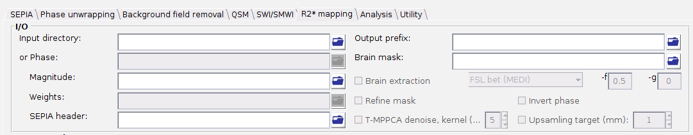
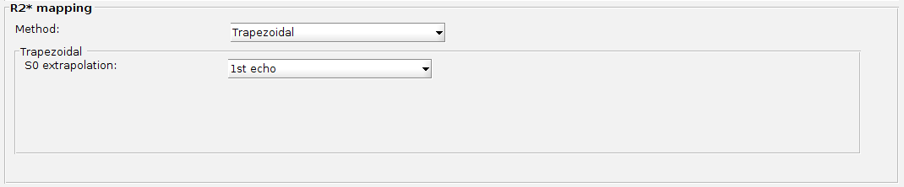

.. _gui-R2star-standalone:
.. _R2star-standalone:
.. role::  raw-html(raw)
    :format: html

R2* Mapping Standalone
========================

What is R2* mapping?
----------------------

R2* is the effective transverse relaxation rate of the multi-echo gradient-echo magnitude signal, i.e. the rate at which the signal magnitude decays across echo times. Since magnetic susceptibility sources contribute to this decay, R2* mapping is often used alongside QSM, e.g. as a proxy measure related to iron content, or as an input to :ref:`2-pass masking <method-qsm-two-pass-masking>` and mask refinement elsewhere in SEPIA.

.. seealso::
  See :ref:`method-R2star` for a detailed description of the algorithms supported in this standalone.

Structure of the application
------------------------------

This standalone consists of two panels:

- I/O panel, and
- R2* mapping panel.

Description of each panel is given below:

I/O panel
^^^^^^^^^^

This standalone reuses the same I/O panel as the other standalones, but several options that are not applicable to R2* mapping are disabled on this tab:

- Data input

  There are two pathways to specify input in this application:

  1. Specify a directory that contains all essential data.

    The essential data are:

    +-----------+-------------------------------------------------------------------------------------------------+
    | Data      | Description                                                                                     |
    +===========+=================================================================================================+
    | Magnitude | 4D magnitude data ([x,y,slice,time]), must contain 'mag' in the filename, e.g. *magn.nii.gz* or |
    |           | *mag.nii.gz*                                                                                    |
    +-----------+-------------------------------------------------------------------------------------------------+
    | Header    | see :ref:`sepia-header` for more information, must contain 'header' in the filename, e.g.       |
    |           | *header.mat*                                                                                    |
    +-----------+-------------------------------------------------------------------------------------------------+
    | Mask      | 3D signal mask, must contain string 'mask' in the filename, e.g. *mask.nii.gz*                  |
    +-----------+-------------------------------------------------------------------------------------------------+

    .. warning::
      Please make sure the filenames follow the above rules, or the BIDS specification (see **Data Input** in :ref:`Data-preparation`), and no other files in the directory sharing the same string labels (i.e. 'mag', 'header' and 'mask').

  2. Specify the required data separately using the GUI buttons.

  .. note::
    The 'Phase'/'Fieldmap'/'Local field' and 'Weights' input fields (used by the other tabs) are disabled here - R2* mapping only requires the magnitude data.

- Output prefix

  By default, the output files generated by SEPIA will be stored in a directory named '*output*' under the directory of the input files (i.e. '_/your/input/directory/output/_'). The prefix of the output filename is '*Sepia*'. You can change the default output directory and prefix according to your preference. If the output directory does not exist, the application will create the directory.

  .. note::
    Make sure the 'Output prefix' field contains a full path of the output directory and a filename prefix.

- Brain mask

  A signal (brain) mask NIfTI file must be specified (either found automatically in the input directory or specified explicitly).

  .. note::
    'Brain extraction', 'Invert phase data', 'Refine mask', 'T-MPPCA denoise' and 'Upsampling target' are all disabled on this tab, since they are not applicable (or not yet supported) for R2* mapping alone.

R2* mapping panel
^^^^^^^^^^^^^^^^^^^

- Method

  Select a R2* mapping method. The method parameters will be displayed on the method panel.

**Trapezoidal**, **ARLO**, **Geometric sum** and **Sequence of product** parameters:

- S0 extrapolation

  Method used to estimate the signal at zero echo time (S0): '1st echo' - use the first echo directly, 'Weighted sum' - a weighted sum, or 'Averaging' - a simple average.

**Sequence of product** has an additional parameter:

- Method

  Whether the echoes are treated as '1st echo' referenced or 'interleaved' when forming the sequence of products.

**Linear regression** has no additional tunable parameter.

**Non-linear least square (NLLS)** parameters:

- Enable parallel computing (parfor)

  If enabled, voxel-wise NLLS fitting is parallelised using MATLAB's ``parfor``, which can substantially speed up processing on a machine with multiple CPU cores.

Others
^^^^^^^

.. image:: images/start_button_anno.png

- Load config

  Import the method related settings specified in the SEPIA-generated config file to the SEPIA GUI. **NO** modification will be made in the I/O panel.

- Start

  Generate a SEPIA config file that contains all user-defined methods and parameters for R2* mapping based on the setting in the GUI. SEPIA will run the config file immediately once it is generated.
