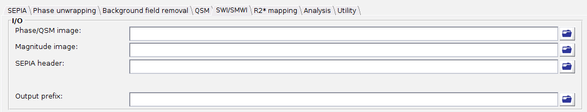
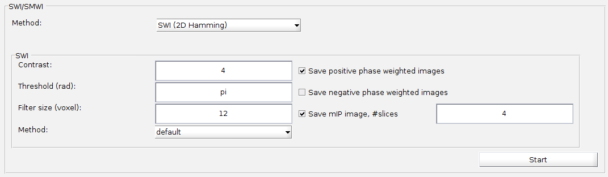

.. _gui-SWI-SMWI-standalone:
.. _SWI-SMWI-standalone:
.. role::  raw-html(raw)
    :format: html

SWI/SMWI Standalone
====================

What are SWI and SMWI?
-----------------------

Susceptibility weighted imaging (SWI) enhances the visibility of veins and other magnetic-susceptibility-rich structures (e.g. iron-containing deep grey matter, microbleeds and calcifications) by multiplying a magnitude image with a phase mask derived from a high-pass filtered phase image. Susceptibility map weighted imaging (SMWI) follows the same idea, but uses a QSM map instead of the phase image to generate the weighting mask, so that the paramagnetic (e.g. iron, venous blood) and diamagnetic (e.g. calcification) sources can be separated and displayed in their own weighted images.

.. seealso::
  See :ref:`method-SWI` for a detailed description of the algorithms supported in this standalone.

Structure of the application
-----------------------------

This standalone consists of two panels:

- I/O panel, and
- SWI/SMWI panel.

Description of each panel is given below:

I/O panel
^^^^^^^^^^

The I/O panel is responsible for data input/output for this standalone.

- Data input

  Unlike the other standalones, this application does not support directory-based auto-detection - specify each of the following files individually using the GUI buttons:

  +-----------------+------------------------------------------------------------------------------------------+
  | Data            | Description                                                                              |
  +=================+==========================================================================================+
  | Phase/QSM image | 4D phase data ([x,y,slice,time]) for 'SWI (2D Hamming)' and 'CLEAR-SWI', or a 3D QSM map |
  |                 | ([x,y,slice]) for 'SMWI', depending on the method selected in the SWI/SMWI panel         |
  +-----------------+------------------------------------------------------------------------------------------+
  | Magnitude image | 4D magnitude data ([x,y,slice,time])                                                     |
  +-----------------+------------------------------------------------------------------------------------------+
  | SEPIA header    | see :ref:`sepia-header` for more information                                             |
  +-----------------+------------------------------------------------------------------------------------------+

- Output prefix

  By default, when a phase/QSM image is selected, the output basename is automatically set to '_/your/input/directory/output/Sepia_'. You can change the default output directory and prefix according to your preference. If the output directory does not exist, the application will create the directory.

  .. note::
    Make sure the 'Output prefix' field contains a full path of the output directory and a filename prefix.

SWI/SMWI panel
^^^^^^^^^^^^^^^

- Method

  Select 'SWI (2D Hamming)', 'SMWI' or (if the CLEAR-SWI addon is enabled) 'CLEAR-SWI'. The method parameters will be displayed on the method panel.

  .. note::
    'CLEAR-SWI' is provided as an optional addon and is only available in the dropdown if it has been enabled - see :ref:`method-SWI` for more information.

**SWI (2D Hamming)** parameters:

- Contrast

  Number of times the (normalised) phase mask is multiplied onto the magnitude image, controlling the strength of the phase contrast in the final SWI image.

- Threshold (rad)

  Phase values (in radian) beyond this threshold are fully suppressed by the phase mask. Default is π.

- Filter size (voxel)

  Kernel size (in voxel) of the 2D Hamming high-pass filter used to remove the low-spatial-frequency (background) component of the phase before computing the phase mask.

- Method

  Echo combination method used before computing the phase mask.

- Save positive/negative phase weighted images

  Export the SWI images computed using the positive and/or negative phase mask (i.e. suppressing diamagnetic and/or paramagnetic susceptibility sources respectively).

- Save mIP image, #slices

  If enabled, also export a minimum intensity projection (mIP) image, computed over the specified number of neighbouring slices.

**SMWI** parameters:

- Contrast

  Number of times the (normalised) susceptibility mask is multiplied onto the magnitude image, controlling the strength of the susceptibility contrast in the final SMWI image.

- Threshold (ppm)

  QSM values (in ppm) beyond this threshold are fully suppressed by the susceptibility mask.

- Save paramagnetic/diamagnetic weighted images

  Export the SMWI images computed using the paramagnetic (positive susceptibility) and/or diamagnetic (negative susceptibility) mask respectively.

- Save mIP image, #slices

  If enabled, also export a minimum intensity projection (mIP) image, computed over the specified number of neighbouring slices.

**CLEAR-SWI** parameters (addon):

- Phase Function

  Non-linear function ('tanh', 'negativetanh', 'positive', 'negative' or 'triangular') used to convert the high-pass filtered phase into the phase mask.

- Phase Contrast

  Controls the strength of the phase contrast applied by the Phase Function above.

- Filter size

  Kernel size (in voxel, one value per dimension, e.g. ``[4,4,0]``) of the high-pass filter used to remove the background phase.

- Unwrapping Algorithm

  Phase unwrapping method ('laplacian', 'romeo' or 'laplacianslice') used internally before high-pass filtering.

- Magnitude Echo Combination

  Method used to combine the multi-echo magnitude data ('SNR', 'average', 'echo' or 'simulated echo').

  .. note::
    The 'echonumber/echotime' field is only enabled when 'echo' or 'simulated echo' is selected above, specifying which echo (or echo time) to use.

- Softplus Magnitude Scaling

  If enabled, applies a softplus-based scaling to the magnitude image before combining it with the phase mask, to reduce the influence of very low-signal voxels.

- Sensitivity Correction

  If enabled, corrects for coil sensitivity-related intensity variations across the magnitude image.

- Save mIP image, #slices

  If enabled, also export a minimum intensity projection (mIP) image, computed over the specified number of neighbouring slices.

Others
^^^^^^^

- Start

  Generate a SEPIA config file that contains all user-defined methods and parameters for SWI/SMWI processing based on the setting in the GUI. SEPIA will run the config file immediately once it is generated.
