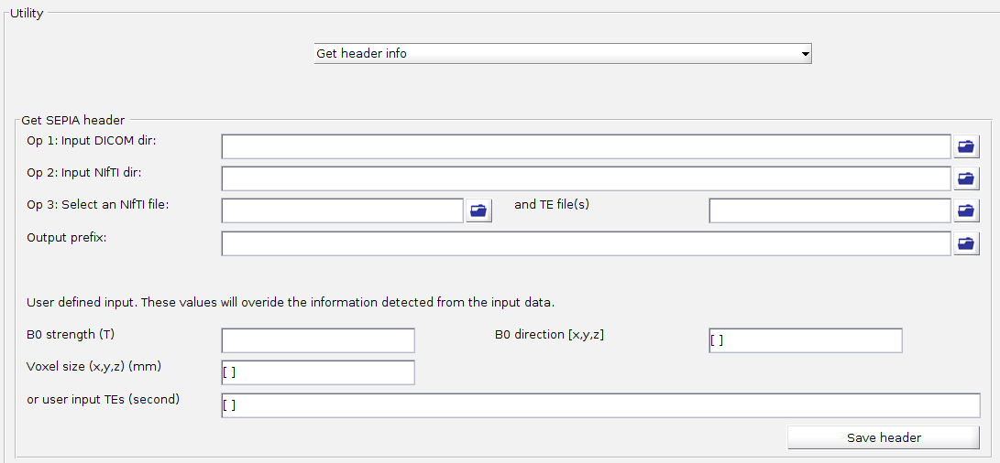
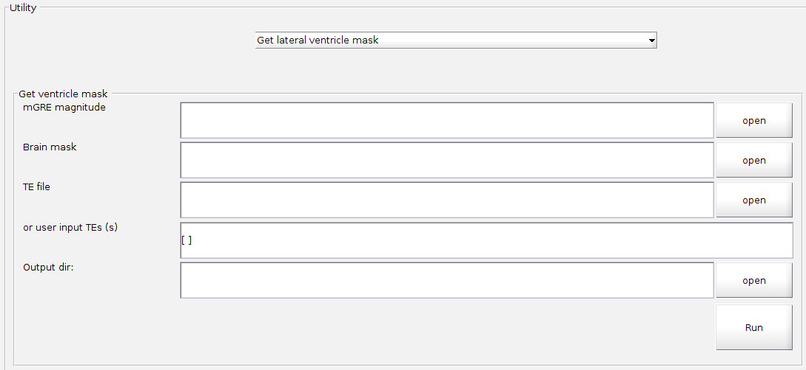
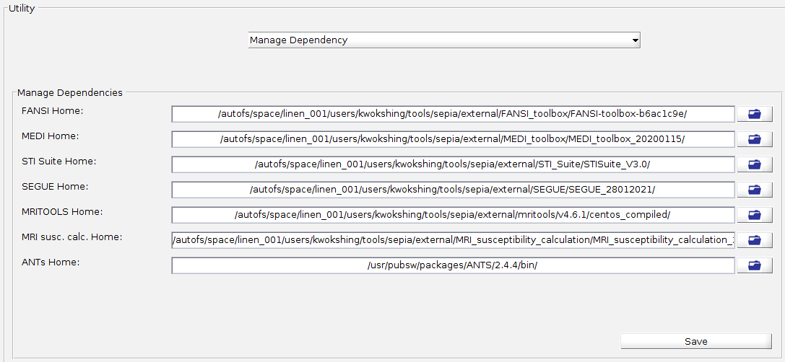
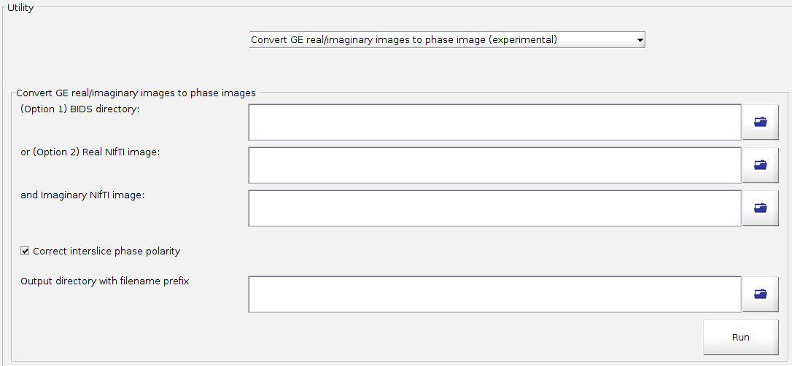

.. _gui-Utility-standalone:
.. _Utility-standalone:
.. role::  raw-html(raw)
    :format: html

Utility
========

What is the Utility tab?
---------------------------

The Utility tab collects a handful of standalone helper tools that support the main SEPIA pipeline, but are not themselves part of it - e.g. generating a :ref:`sepia-header` file from raw data, or managing where SEPIA looks for its optional external toolboxes.

Structure of the application
------------------------------

Like the :ref:`Analysis-standalone`, the Utility tab does not share the universal I/O panel or Start button - it consists of a single panel:

- Utility panel, which lets you pick one of four helper tools; each tool has its own dedicated input/output fields and Run/Save button.

Utility panel
^^^^^^^^^^^^^^

- Method

  Select one of the four supported tools:

  - Get header info
  - Get lateral ventricle mask
  - Manage Dependency
  - Convert GE real/imaginary images to phase image (experimental)

Each tool is described in its own section below.

Get header info
""""""""""""""""

Generates a :ref:`sepia-header` file from DICOM or NIfTI data, without having to run it through the rest of the SEPIA pipeline.

- Op 1: Input DICOM dir

  A directory containing all (magnitude and phase) mGRE DICOM files. No further input is needed if you use this option.

- Op 2: Input NIfTI dir

  A directory containing ONLY NIfTI and JSON/text files. No further input is needed if you use this option.

- Op 3: Select an NIfTI file

  A single mGRE NIfTI file, together with:

  - and TE file(s)

    Can be either a SEPIA header (.mat), MRIConvert text (.txt), or ``dicm2nii``/``dcm2niix`` JSON file(s).

- Output prefix

  Output directory (and filename prefix) where the generated SEPIA header .mat file will be stored.

- User defined input

  These values override the information detected from the input data:

  - B0 strength (T)

    Magnetic field strength in Tesla (default: 3).

  - B0 direction [x,y,z]

    Magnetic field direction.

  - Voxel size (x,y,z) (mm)

    Voxel size of the image, in the order [x,y,z].

  - or user input TEs (second)

    Echo times (TE, in seconds) of all echoes.

- Save header

  Generates and saves the SEPIA header file using the settings above.

Get lateral ventricle mask
"""""""""""""""""""""""""""

Generates a lateral ventricle (CSF) mask from a multi-echo GRE magnitude image, e.g. for use as a reference region in QSM value referencing. MEDI toolbox is required.

- mGRE magnitude

  Multi-echo GRE (4D) magnitude NIfTI file.

- Brain mask

  Brain mask NIfTI file (optional).

- TE file

  Can be either a SEPIA header (.mat) or MRIConvert text (.txt) file.

- or user input TEs (s)

  Echo time (TE, in s) of each echo, if a TE file is not provided.

- Output dir

  Output directory where the output mask file will be stored.

- Run

  Generates and saves the lateral ventricle mask using the settings above.

Manage Dependency
"""""""""""""""""""

Lets you view and update the local paths to SEPIA's optional external toolboxes, i.e. the same information stored in ``SpecifyToolboxesDirectory.m``.

- FANSI Home / MEDI Home / STI Suite Home / SEGUE Home / MRITOOLS Home / MRI susc. calc. Home / ANTs Home

  The local installation directory of each corresponding toolbox. Leave a field empty if you don't have that toolbox installed - methods requiring it will simply be unavailable in the GUI.

- Save

  Writes any changed (non-empty) paths above back into ``SpecifyToolboxesDirectory.m``.

Convert GE real/imaginary images to phase image (experimental)
""""""""""""""""""""""""""""""""""""""""""""""""""""""""""""""""

.. warning::
  This tool is experimental.

Some GE scanners export real/imaginary images instead of phase images directly - this tool computes the phase image from a pair of real and imaginary images.

- (Option 1) BIDS directory

  A BIDS directory containing real (``*part-real*.nii*``) and imaginary (``*part-imaginary*.nii*``) NIfTI images - all matching echoes found in the directory will be converted.

- or (Option 2) Real NIfTI image

  A single real-part NIfTI image, together with:

- and Imaginary NIfTI image

  The corresponding single imaginary-part NIfTI image.

- Correct interslice phase polarity

  If enabled, flips the sign of every other slice in both the real and imaginary images before computing the phase, to correct GE's interslice phase polarity alternation.

- Output directory with filename prefix

  Output directory and filename prefix where the computed phase image(s) will be saved.

- Run

  Computes and saves the phase image(s) using the settings above.
