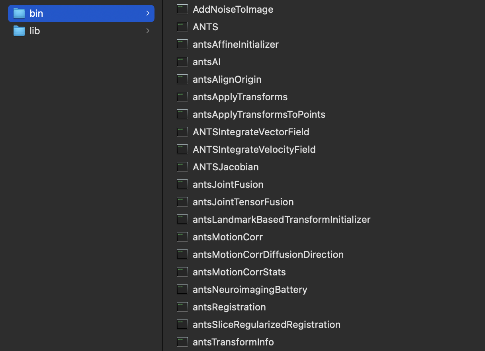
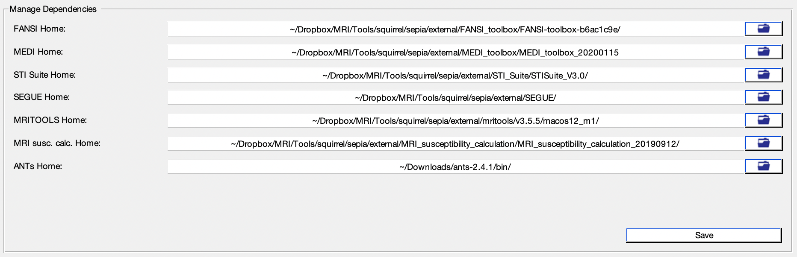
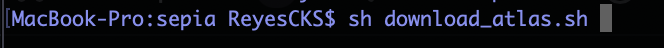

.. _segmentation-in-sepia:

Subcortical structure segmentation in SEPIA
===========================================

Starting from v1.2, SEPIA supports several atlas-based subcortical structure segmentation methods, based on non-linear registration using `ANTs <https://github.com/ANTsX/ANTs>`_. 

Set-up SEPIA for subcortical structure segmentation
---------------------------------------------------

Before using any of these methods, 'ANTS_HOME' has to be specified in SpecifyToolboxesDirectory.m or using the Manage Dependency tool in the Utility tab. 

The path required for 'ANTS_HOME' should be the bin folder of ANTs that contains all the libraries, e.g.,

and in the Manage Dependency tool it should be like

.. note:: If you don't have ANTs, you can still use SEPIA for QSM reconstruction but you can't use the segmentation methods provided in the Analysis tab.

Then you need to download the atlases from their corresponding online sources. This is done with ``download_atlas.m``, which works the same way on Windows, macOS and Linux (it replaces the older ``download_atlas.sh`` shell script, which could not run on Windows and was unreliable on macOS). From the MATLAB command window, with SEPIA_HOME on the path:

.. code-block:: matlab

    download_atlas

.. note:: This screenshot still shows the retired ``sh download_atlas.sh`` command; it needs to be retaken for ``download_atlas``.

By default, the atlases will be downloaded in SEPIA_HOME/atlas/. Make sure you have enough disk space in your computer and do not alter the location where the atlases stored. Re-running ``download_atlas`` is safe - any atlas already present is skipped.

There are currently three atlases supported:

.. toctree::
   :maxdepth: 1
   :caption: Supported algorithms in SEPIA
   :name: sec-method-swi

   segmentation/cit168_rl
   segmentation/musus100
   segmentation/ahead
