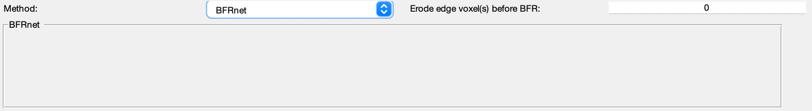

.. _method-bfv-bfrnet:
.. _bfv-bfrnet:
.. role::  raw-html(raw)
    :format: html

BFRnet
======

`Xuanyu Zhu, Yang Gao, Feng Liu, Stuart Crozier, Hongfu Sun, 2022. BFRnet: A deep learning-based MR background field removal method for QSM of the brain containing significant pathological susceptibility sources <https://arxiv.org/abs/2204.02760>`_ 

Setup BFRnet for SEPIA
----------------------
1. Download `deepMRI <https://github.com/sunhongfu/deepMRI>`_ from GitHub
2. Download the pre-trained BFRnet `here <https://www.dropbox.com/sh/q678oapc65evrfa/AADh2CGeUzhHh6q9t3Fe3fVVa?dl=0>`_ as mentioned in the instruction on GitHub
3. Specify the full path to deepMRI code as 'deepMRI_HOME' in setup_BFRnet_environment.m in SEPIA_HOME/addons/bfr/BFRnet/
4. Specify the full path to the pre-trained network (should be checkpoints/BFRnet_L2_64PS_24BS_45Epo_NewHCmix.mat) from (2) as 'checkpoints' in setup_BFRnet_environment.m

Your setup_BFRnet_environment.m should look something like this:

.. image:: ../images/bfr/BFRnet_setup.png

.. warning::
    The support this method is still in an early stage and only tested on a Linux machine.

BFRnet panel
------------
There is no algorithm parameter needed to be adjusted with this tool at the moment.

