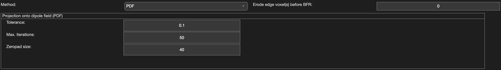

.. _method-bfv-pdf:
.. _bfv-pdf:
.. role::  raw-html(raw)
    :format: html

Projection onto Dipole Field (PDF)
==================================

Reference:
`Liu, T., Khalidov, I., Rochefort, L. de, Spincemaille, P., Liu, J., Tsiouris, A.J., Wang, Y., 2011. A novel background field removal method for MRI using projection onto dipole fields (PDF). NMR in biomedicine 24, 1129–1136.  <https://doi.org/10.1002/nbm.1670>`_ 

Algorithm parameters overview
------------------------------

+-----------------+---------------------------------------------------------------------------+
| algorParam.bfr. | Description                                                               |
+=================+===========================================================================+
| tol             | Stopping criteria                                                         |
+-----------------+---------------------------------------------------------------------------+
| iteration       | Maximum number of iterations allowed                                      |
+-----------------+---------------------------------------------------------------------------+
| padSize         | No. of zeros to be added after the last array element (zero padding size) |
+-----------------+---------------------------------------------------------------------------+

Usage
-----

algorParam.bfr.tol
^^^^^^^^^^^^^^^^^^

Stopping criteria

**Default Value: 0.1**

Examples:

``algorParam.bfr.tol = 1;``

``algorParam.bfr.tol = 0.1;``

``algorParam.bfr.tol = 0.01;``

algorParam.bfr.iteration
^^^^^^^^^^^^^^^^^^^^^^^^

Maximum number of iterations allowed

**Default Value: 50**

Examples:

``algorParam.bfr.iteration = 30;``

``algorParam.bfr.iteration = 50;``

``algorParam.bfr.iteration = 100;``

algorParam.bfr.padSize
^^^^^^^^^^^^^^^^^^^^^^

No. of zeros to be added after the last array element (zero padding size)

**Default Value: 40**

Examples:

``algorParam.bfr.padSize = 0;``

``algorParam.bfr.padSize = 40;``

``algorParam.bfr.padSize = 80;``
