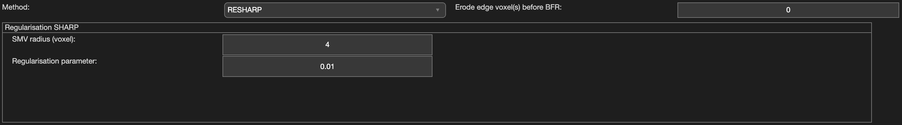

.. _method-bfv-resharp:
.. _bfv-resharp:
.. role::  raw-html(raw)
    :format: html

Regularisation Enabled SHARP (RESHARP)
======================================

Reference:
`Sun, H., Wilman, A.H., 2014. Background field removal using spherical mean value filtering and Tikhonov regularization. Magnetic resonance in medicine 71, 1151–1157. <https://doi.org/10.1002/mrm.24765>`_ 

Algorithm parameters overview
------------------------------

+-----------------+----------------------------------------------------------+
| algorParam.bfr. | Description                                              |
+=================+==========================================================+
| radius          | Radius of spherical mean value (SMV) kernel, in voxel    |
+-----------------+----------------------------------------------------------+
| alpha           | Regularisation parameter used in Tikhonov regularisation |
+-----------------+----------------------------------------------------------+

Usage
-----

algorParam.bfr.radius
^^^^^^^^^^^^^^^^^^^^^

Radius of spherical mean value (SMV) kernel, in voxel

**Default Value: 4**

Examples:

``algorParam.bfr.radius = 2;``

``algorParam.bfr.radius = 4;``

``algorParam.bfr.radius = 6;``

algorParam.bfr.alpha
^^^^^^^^^^^^^^^^^^^^

Regularisation parameter used in Tikhonov regularisation

**Default Value: 0.01**

Examples:

``algorParam.bfr.alpha = 0.001;``

``algorParam.bfr.alpha = 0.01;``

``algorParam.bfr.alpha = 0.1;``
