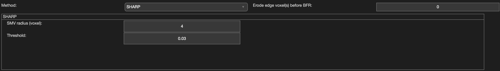

.. _method-bfv-sharp:
.. _bfv-sharp:
.. role::  raw-html(raw)
    :format: html

Sophisticated Harmonic Artefact Reduction for Phase data (SHARP)
================================================================

Reference:
`Schweser, F., Deistung, A., Lehr, B.W., Reichenbach, J.R., 2011. Quantitative imaging of intrinsic magnetic tissue properties using MRI signal phase: an approach to in vivo brain iron metabolism? Neuroimage 54, 2789–2807. <https://doi.org/10.1016/j.neuroimage.2010.10.070>`_ 

Algorithm parameters overview
------------------------------

+-----------------+-------------------------------------------------------+
| algorParam.bfr. | Description                                           |
+=================+=======================================================+
| radius          | Radius of spherical mean value (SMV) kernel, in voxel |
+-----------------+-------------------------------------------------------+
| threshold       | Threshold used in Truncated SVD                       |
+-----------------+-------------------------------------------------------+

Usage
-----

algorParam.bfr.radius
^^^^^^^^^^^^^^^^^^^^^

Radius of spherical mean value (SMV) kernel, in voxel

**Default Value: 4**

Examples:

``algorParam.bfr.radius = 2;``

``algorParam.bfr.radius = 4;``

``algorParam.bfr.radius = 6;``

algorParam.bfr.threshold
^^^^^^^^^^^^^^^^^^^^^^^^

Threshold used in Truncated SVD

**Default Value: 0.03**

Examples:

``algorParam.bfr.threshold = 0.01;``

``algorParam.bfr.threshold = 0.03;``

``algorParam.bfr.threshold = 0.05;``
