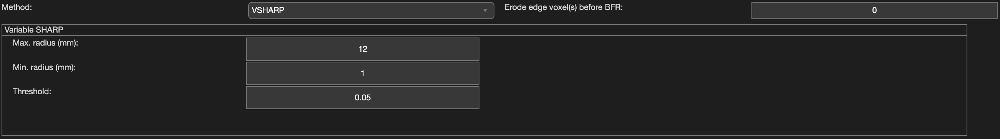

.. _method-bfv-vsharp:
.. _bfv-vsharp:
.. role::  raw-html(raw)
    :format: html

Variable-kernel SHARP (VSHARP)
==============================

Reference:
`Li, W., Wu, B., Liu, C., 2011. Quantitative susceptibility mapping of human brain reflects spatial variation in tissue composition. Neuroimage 55, 1645–1656. <https://doi.org/10.1016/j.neuroimage.2010.11.088>`_ 

.. note::
    Since v1.3.0, ``algorParam.bfr.radius`` (and the corresponding 'Max./Min. radius' fields in the GUI panel) is specified in **mm** instead of voxels. If you are updating a pipeline script written for an earlier SEPIA version, convert your previous voxel-based radius values to mm (i.e. multiply by voxel size) before reusing them.

.. warning::
    Prior to v1.3.0, the built-in VSHARP implementation was missing the k-space deconvolution step after the spherical-mean-value subtraction, resulting in incomplete background field removal. This has been fixed in v1.3.0. Local field/QSM results previously generated with SEPIA's built-in VSHARP should be recomputed with the current version.

Algorithm parameters overview
------------------------------

+-----------------+-------------------------------------------------------------------------------------------------------------------+
| algorParam.bfr. | Description                                                                                                       |
+=================+===================================================================================================================+
| radius          | Vector of radii of the spherical mean value (SMV) kernel, in mm, formed from the Max./Min. radius as [Max:-1:Min] |
+-----------------+-------------------------------------------------------------------------------------------------------------------+
| threshold       | Threshold used in the k-space deconvolution (Truncated SVD)                                                       |
+-----------------+-------------------------------------------------------------------------------------------------------------------+

Usage
-----

algorParam.bfr.radius
^^^^^^^^^^^^^^^^^^^^^

Vector of radii of the spherical mean value (SMV) kernel, in mm, formed from the Max. and Min. radius edit fields in the GUI panel, i.e. [Max:-1:Min]

**Default Value: [12:-1:1]**

Examples:

``algorParam.bfr.radius = [10:-1:1];``

``algorParam.bfr.radius = [12:-1:1];``

``algorParam.bfr.radius = [15:-1:2];``

algorParam.bfr.threshold
^^^^^^^^^^^^^^^^^^^^^^^^

Threshold used in the k-space deconvolution (Truncated SVD)

**Default Value: 0.05**

Examples:

``algorParam.bfr.threshold = 0.01;``

``algorParam.bfr.threshold = 0.05;``

``algorParam.bfr.threshold = 0.1;``
