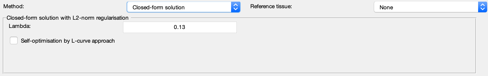

.. _method-qsm-cfs:
.. _qsm-cfs:
.. role::  raw-html(raw)
    :format: html

Closed-form solution with L2-norm regularisation
================================================

Reference:
`Bilgic, B., Chatnuntawech, I., Fan, A.P., Setsompop, K., Cauley, S.F., Wald, L.L., Adalsteinsson, E., 2014. Fast image reconstruction with L2‐regularization. Journal of magnetic resonance imaging : JMRI 40, 181–191. <https://doi.org/10.1002/jmri.24365>`_ 

