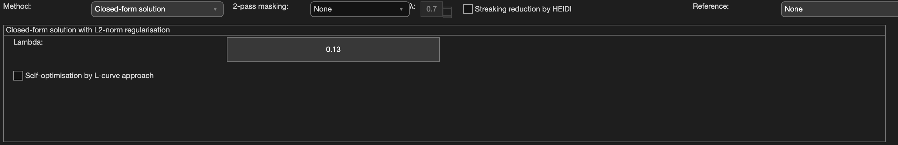

.. _method-qsm-cfs:
.. _qsm-cfs:
.. role::  raw-html(raw)
    :format: html

Closed-form solution with L2-norm regularisation
================================================

Reference:
`Bilgic, B., Chatnuntawech, I., Fan, A.P., Setsompop, K., Cauley, S.F., Wald, L.L., Adalsteinsson, E., 2014. Fast image reconstruction with L2‐regularization. Journal of magnetic resonance imaging : JMRI 40, 181–191. <https://doi.org/10.1002/jmri.24365>`_ 

Algorithm parameters overview
------------------------------

+---------------------------+--------------------------------------------------------------------------------------------------------------+
| algorParam.qsm.           | Description                                                                                                  |
+===========================+==============================================================================================================+
| lambda                    | Regularisation parameter to control spatial smoothness of QSM                                                |
+---------------------------+--------------------------------------------------------------------------------------------------------------+
| optimise                  | Self estimation of lambda based on L-curve approach (true/false)                                             |
+---------------------------+--------------------------------------------------------------------------------------------------------------+

Usage
-----

algorParam.qsm.lambda
^^^^^^^^^^^^^^^^^^^^^

Regularisation parameter to control spatial smoothness of QSM. This parameter is only used when ``algorParam.qsm.optimise`` is set to ``false``; when self-optimisation is enabled the edit field is disabled and this value is ignored.

**Default Value: 0.13**

Examples:

``algorParam.qsm.lambda = 0.05;``

``algorParam.qsm.lambda = 0.13;``

``algorParam.qsm.lambda = 0.5;``

algorParam.qsm.optimise
^^^^^^^^^^^^^^^^^^^^^^^

Self estimation of lambda based on an L-curve approach. When set to ``true``, ``algorParam.qsm.lambda`` is automatically determined and its GUI edit field is disabled; when set to ``false``, the value specified in ``algorParam.qsm.lambda`` is used directly.

**Default Value: false**

Examples:

``algorParam.qsm.optimise = false;``

``algorParam.qsm.optimise = true;``
