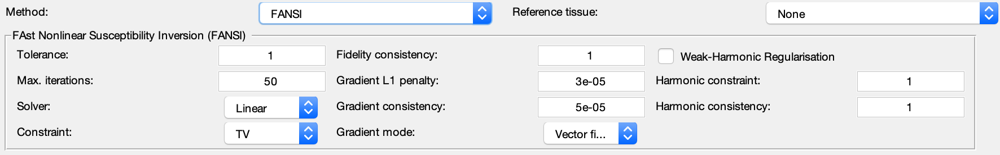

.. _method-qsm-fansi:
.. _qsm-fansi:
.. role::  raw-html(raw)
    :format: html

FAst Nonlinear Susceptibility Inversion (FANSI)
===============================================

References:
`Milovic, C., Bilgic, B., Zhao, B., Acosta-Cabronero, J., Tejos, C., 2018. Fast nonlinear susceptibility inversion with variational regularization. Magnetic resonance in medicine 80, 814–821. <https://doi.org/10.1002/mrm.27073>`_ 

`Milovic, C., Bilgic, B., Zhao, B., Langkammer, C., Tejos, C., Cabronero, J.A., 2019. Weak-harmonic regularization for quantitative susceptibility mapping. Magnetic resonance in medicine 81, 1399–1411. <https://doi.org/10.1002/mrm.27483>`_

.. note::
    Current algorithm parameters are adapted for FANSI v3. Please refer to FANSI v1 for recommended parameter values if you used FANSI v1.
