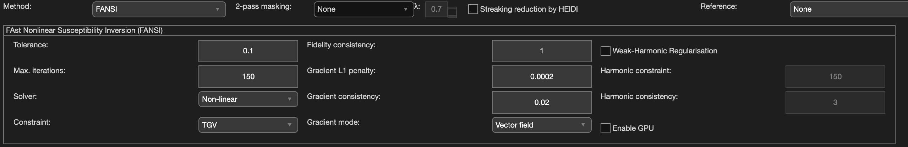

.. _method-qsm-fansi:
.. _qsm-fansi:
.. role::  raw-html(raw)
    :format: html

FAst Nonlinear Susceptibility Inversion (FANSI)
===============================================

References:
`Milovic, C., Bilgic, B., Zhao, B., Acosta-Cabronero, J., Tejos, C., 2018. Fast nonlinear susceptibility inversion with variational regularization. Magnetic resonance in medicine 80, 814–821. <https://doi.org/10.1002/mrm.27073>`_ 

`Milovic, C., Bilgic, B., Zhao, B., Langkammer, C., Tejos, C., Cabronero, J.A., 2019. Weak-harmonic regularization for quantitative susceptibility mapping. Magnetic resonance in medicine 81, 1399–1411. <https://doi.org/10.1002/mrm.27483>`_

.. note::
    Current algorithm parameters are adapted for FANSI v3. Please refer to FANSI v1 for recommended parameter values if you used FANSI v1.

Algorithm parameters overview
-----------------------------

+---------------------------+------------------------------------------------------------------------------------------------------+
| algorParam.qsm.           | Description                                                                                          |
+===========================+======================================================================================================+
| tol                       | Convergence limit, i.e. change rate in the solution (adapted for FANSI v3)                           |
+---------------------------+------------------------------------------------------------------------------------------------------+
| maxiter                   | Maximum number of iterations allowed (adapted for FANSI v3)                                          |
+---------------------------+------------------------------------------------------------------------------------------------------+
| lambda                    | Gradient L1 penalty, i.e. alpha1, regularisation weight (adapted for FANSI v3)                       |
+---------------------------+------------------------------------------------------------------------------------------------------+
| mu1                       | Gradient consistency weight, i.e. mu1 (adapted for FANSI v3); recommended value = 100*lambda         |
+---------------------------+------------------------------------------------------------------------------------------------------+
| mu2                       | Fidelity consistency weight, i.e. mu2; recommended value = 1                                         |
+---------------------------+------------------------------------------------------------------------------------------------------+
| solver                    | Linear or non-linear algorithm for dipole inversion. Options: 'Non-linear', 'Linear'                 |
+---------------------------+------------------------------------------------------------------------------------------------------+
| constraint                | TV or TGV regularisation. Options: 'TGV', 'TV'                                                       |
+---------------------------+------------------------------------------------------------------------------------------------------+
| gradient_mode             | Method for regularisation spatially variable weight. Options: 'Vector field', 'L1 norm', 'L2 norm',  |
|                           | 'None'                                                                                               |
+---------------------------+------------------------------------------------------------------------------------------------------+
| isWeakHarmonic            | Logical value of using weak-harmonic regularisation                                                  |
+---------------------------+------------------------------------------------------------------------------------------------------+
| beta                      | Harmonic constraint weight (only relevant/enabled when isWeakHarmonic is true, adapted for FANSI v3) |
+---------------------------+------------------------------------------------------------------------------------------------------+
| muh                       | Harmonic consistency weight (only relevant/enabled when isWeakHarmonic is true, adapted for FANSI    |
|                           | v3); recommended value = beta/50                                                                     |
+---------------------------+------------------------------------------------------------------------------------------------------+
| isGPU                     | Logical value of enabling GPU computation                                                            |
+---------------------------+------------------------------------------------------------------------------------------------------+

Usage
-----

algorParam.qsm.tol
^^^^^^^^^^^^^^^^^^

Convergence limit, i.e. change rate in the solution, adapted for FANSI v3

**Default Value: 0.1**

Examples:

``algorParam.qsm.tol = 1;``

``algorParam.qsm.tol = 0.1;``

``algorParam.qsm.tol = 0.01;``

algorParam.qsm.maxiter
^^^^^^^^^^^^^^^^^^^^^^

Maximum number of iterations allowed, adapted for FANSI v3

**Default Value: 150**

Examples:

``algorParam.qsm.maxiter = 50;``

``algorParam.qsm.maxiter = 150;``

``algorParam.qsm.maxiter = 300;``

algorParam.qsm.lambda
^^^^^^^^^^^^^^^^^^^^^

Gradient L1 penalty, i.e. alpha1, regularisation weight, adapted for FANSI v3

**Default Value: 2e-4**

Examples:

``algorParam.qsm.lambda = 1e-4;``

``algorParam.qsm.lambda = 2e-4;``

``algorParam.qsm.lambda = 5e-4;``

algorParam.qsm.mu1
^^^^^^^^^^^^^^^^^^

Gradient consistency weight, i.e. mu1, adapted for FANSI v3; recommended value = 100*lambda

**Default Value: 0.02**

Examples:

``algorParam.qsm.mu1 = 0.01;``

``algorParam.qsm.mu1 = 0.02;``

``algorParam.qsm.mu1 = 0.05;``

algorParam.qsm.mu2
^^^^^^^^^^^^^^^^^^

Fidelity consistency weight, i.e. mu2; recommended value = 1

**Default Value: 1**

Examples:

``algorParam.qsm.mu2 = 0.5;``

``algorParam.qsm.mu2 = 1;``

``algorParam.qsm.mu2 = 2;``

algorParam.qsm.solver
^^^^^^^^^^^^^^^^^^^^^

Linear or non-linear algorithm for dipole inversion. Valid options are 'Non-linear' and 'Linear'

**Default Value: 'Non-linear'**

Examples:

``algorParam.qsm.solver = 'Non-linear';``

``algorParam.qsm.solver = 'Linear';``

algorParam.qsm.constraint
^^^^^^^^^^^^^^^^^^^^^^^^^

TV or TGV regularisation. Valid options are 'TGV' and 'TV'

**Default Value: 'TGV'**

Examples:

``algorParam.qsm.constraint = 'TGV';``

``algorParam.qsm.constraint = 'TV';``

algorParam.qsm.gradient_mode
^^^^^^^^^^^^^^^^^^^^^^^^^^^^

Method for regularisation spatially variable weight. Valid options are 'Vector field', 'L1 norm', 'L2 norm' and 'None'

**Default Value: 'Vector field'**

Examples:

``algorParam.qsm.gradient_mode = 'Vector field';``

``algorParam.qsm.gradient_mode = 'L1 norm';``

``algorParam.qsm.gradient_mode = 'None';``

algorParam.qsm.isWeakHarmonic
^^^^^^^^^^^^^^^^^^^^^^^^^^^^^

Logical value of using weak-harmonic regularisation. When set to true, the beta and muh parameters below become active (enabled) in the GUI

**Default Value: false**

Examples:

``algorParam.qsm.isWeakHarmonic = false;``

``algorParam.qsm.isWeakHarmonic = true;``

algorParam.qsm.beta
^^^^^^^^^^^^^^^^^^^

Harmonic constraint weight, adapted for FANSI v3 (only relevant, and only enabled in the GUI, when algorParam.qsm.isWeakHarmonic is true)

**Default Value: 150**

Examples:

``algorParam.qsm.beta = 50;``

``algorParam.qsm.beta = 150;``

``algorParam.qsm.beta = 300;``

algorParam.qsm.muh
^^^^^^^^^^^^^^^^^^

Harmonic consistency weight, adapted for FANSI v3; recommended value = beta/50 (only relevant, and only enabled in the GUI, when algorParam.qsm.isWeakHarmonic is true)

**Default Value: 3**

Examples:

``algorParam.qsm.muh = 1;``

``algorParam.qsm.muh = 3;``

``algorParam.qsm.muh = 6;``

algorParam.qsm.isGPU
^^^^^^^^^^^^^^^^^^^^

Logical value of enabling GPU computation to accelerate the reconstruction

**Default Value: false**

Examples:

``algorParam.qsm.isGPU = false;``

``algorParam.qsm.isGPU = true;``
