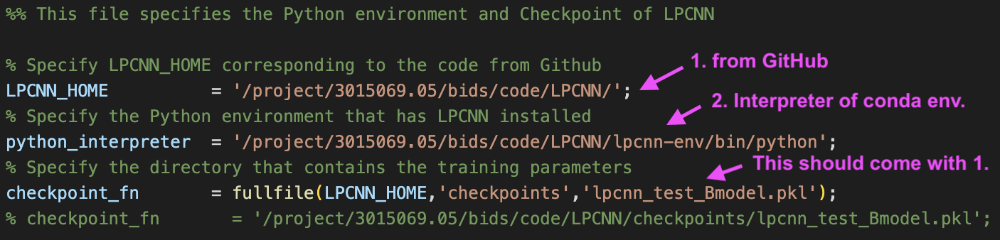
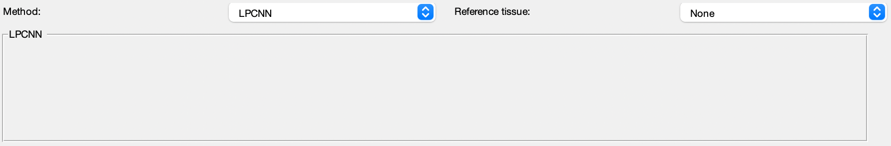

.. _method-qsm-lpcnn:
.. _qsm-lpcnn:
.. role::  raw-html(raw)
    :format: html

LP-CNN
======

Reference:
`Kuo-Wei Lai, Manisha Aggarwal, Peter van Zijl, Xu Li & Jeremias Sulam, 2020. Learned Proximal Networks for Quantitative Susceptibility Mapping <https://link.springer.com/chapter/10.1007/978-3-030-59713-9_13>`_ 

Setup LP-CNN for SEPIA
----------------------
1. Download `LP-CNN <https://github.com/Sulam-Group/LPCNN>`_ from GitHub
2. If you haven't setup LP-CNN in python, following the instruction in https://github.com/Sulam-Group/LPCNN, to create conda environment (see Section Environment Settings in their GitHub page)
3. Specify the full path to LP-CNN code as 'LPCNN_HOME' in setup_LPCNN_environment.m in SEPIA_HOME/addons/qsm/LPCNN/
4. Specify the full path of the Python interpreter that has LP-CNN installed as 'python_interpreter' in setup_LPCNN_environment.m

Your setup_LPCNN_environment.m should look something like this:

.. warning::
The support this method is still in an early stage and only tested on a Linux machine.

LP-CNN panel
------------
There is no algorithm parameter needed to be adjusted with this tool at the moment.

