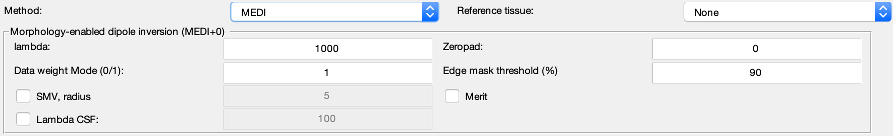

.. _method-qsm-medi:
.. _qsm-medi:
.. role::  raw-html(raw)
    :format: html

Morphology enabled dipole inversion (MEDI)
==========================================

References:
`Liu, T., Liu, J., Rochefort, L. de, Spincemaille, P., Khalidov, I., Ledoux, J.R., Wang, Y., 2011. Morphology enabled dipole inversion (MEDI) from a single-angle acquisition: Comparison with COSMOS in human brain imaging. Magnetic resonance in medicine 66, 777–783. <https://doi.org/10.1002/mrm.22816>`_ 

`LLiu, J., Liu, T., Rochefort, L. de, Ledoux, J., Khalidov, I., Chen, W., Tsiouris, A.J., Wisnieff, C., Spincemaille, P., Prince, M.R., Wang, Y., 2012. Morphology enabled dipole inversion for quantitative susceptibility mapping using structural consistency between the magnitude image and the susceptibility map. Neuroimage 59, 2560–2568. <https://doi.org/10.1016/j.neuroimage.2011.08.082>`_ 

`Liu, Z., Spincemaille, P., Yao, Y., Zhang, Y., Wang, Y., 2018. MEDI+0: Morphology enabled dipole inversion with automatic uniform cerebrospinal fluid zero reference for quantitative susceptibility mapping. Magnetic resonance in medicine 79, 2795–2803. <https://doi.org/10.1002/mrm.26946>`_

