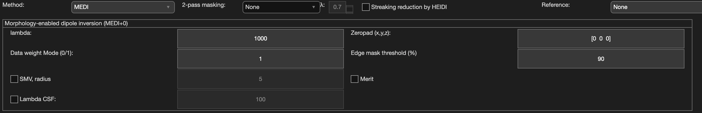

.. _method-qsm-medi:
.. _qsm-medi:
.. role::  raw-html(raw)
    :format: html

Morphology enabled dipole inversion (MEDI)
==========================================

References:
`Liu, T., Liu, J., Rochefort, L. de, Spincemaille, P., Khalidov, I., Ledoux, J.R., Wang, Y., 2011. Morphology enabled dipole inversion (MEDI) from a single-angle acquisition: Comparison with COSMOS in human brain imaging. Magnetic resonance in medicine 66, 777–783. <https://doi.org/10.1002/mrm.22816>`_ 

`LLiu, J., Liu, T., Rochefort, L. de, Ledoux, J., Khalidov, I., Chen, W., Tsiouris, A.J., Wisnieff, C., Spincemaille, P., Prince, M.R., Wang, Y., 2012. Morphology enabled dipole inversion for quantitative susceptibility mapping using structural consistency between the magnitude image and the susceptibility map. Neuroimage 59, 2560–2568. <https://doi.org/10.1016/j.neuroimage.2011.08.082>`_ 

`Liu, Z., Spincemaille, P., Yao, Y., Zhang, Y., Wang, Y., 2018. MEDI+0: Morphology enabled dipole inversion with automatic uniform cerebrospinal fluid zero reference for quantitative susceptibility mapping. Magnetic resonance in medicine 79, 2795–2803. <https://doi.org/10.1002/mrm.26946>`_

Algorithm parameters overview
-----------------------------

+---------------------------+------------------------------------------------------------------------------------------------------+
| algorParam.qsm.           | Description                                                                                          |
+===========================+======================================================================================================+
| lambda                    | Regularisation parameter                                                                             |
+---------------------------+------------------------------------------------------------------------------------------------------+
| wData                     | Method of data weighting. Options: 0 (uniform weighting), 1 (SNR weighting)                          |
+---------------------------+------------------------------------------------------------------------------------------------------+
| zeropad                   | Zero padding after the last element, in x, y, z                                                      |
+---------------------------+------------------------------------------------------------------------------------------------------+
| percentage                | Edge mask threshold: percentage of voxels considered to be edges (percentage option in MEDI)         |
+---------------------------+------------------------------------------------------------------------------------------------------+
| isSMV                     | Logical value of performing spherical mean value (SMV) operation; when true, the radius parameter    |
|                           | below becomes relevant                                                                               |
+---------------------------+------------------------------------------------------------------------------------------------------+
| radius                    | Radius of the spherical mean value operation (only relevant/enabled when isSMV is true)              |
+---------------------------+------------------------------------------------------------------------------------------------------+
| merit                     | Logical value of performing model error reduction through iterative tuning (MERIT)                   |
+---------------------------+------------------------------------------------------------------------------------------------------+
| isLambdaCSF               | Logical value of performing automatic zero reference using CSF (MEDI+0); when true, the lambdaCSF    |
|                           | parameter below becomes relevant                                                                     |
+---------------------------+------------------------------------------------------------------------------------------------------+
| lambdaCSF                 | Regularisation parameter used on the CSF mask (only relevant/enabled when isLambdaCSF is true)       |
+---------------------------+------------------------------------------------------------------------------------------------------+

Usage
-----

algorParam.qsm.lambda
^^^^^^^^^^^^^^^^^^^^^

Regularisation parameter

**Default Value: 1000**

Examples:

``algorParam.qsm.lambda = 500;``

``algorParam.qsm.lambda = 1000;``

``algorParam.qsm.lambda = 2000;``

algorParam.qsm.wData
^^^^^^^^^^^^^^^^^^^^

Method of data weighting. Valid options are 0 (uniform weighting) and 1 (SNR weighting)

**Default Value: 1**

Examples:

``algorParam.qsm.wData = 0;``

``algorParam.qsm.wData = 1;``

algorParam.qsm.zeropad
^^^^^^^^^^^^^^^^^^^^^^

Zero padding after the last element, specified as a 3-element vector for the x, y, z dimensions

**Default Value: [0 0 0]**

Examples:

``algorParam.qsm.zeropad = [0 0 0];``

``algorParam.qsm.zeropad = [0 0 8];``

``algorParam.qsm.zeropad = [4 4 4];``

algorParam.qsm.percentage
^^^^^^^^^^^^^^^^^^^^^^^^^

Edge mask threshold, i.e. the percentage of voxels considered to be edges (percentage option in MEDI)

**Default Value: 90**

Examples:

``algorParam.qsm.percentage = 70;``

``algorParam.qsm.percentage = 90;``

``algorParam.qsm.percentage = 100;``

algorParam.qsm.isSMV
^^^^^^^^^^^^^^^^^^^^

Logical value of performing spherical mean value (SMV) operation. When set to true, the radius parameter below becomes active (enabled) in the GUI

**Default Value: false**

Examples:

``algorParam.qsm.isSMV = false;``

``algorParam.qsm.isSMV = true;``

algorParam.qsm.radius
^^^^^^^^^^^^^^^^^^^^^

Radius of the spherical mean value operation (only relevant, and only enabled in the GUI, when algorParam.qsm.isSMV is true)

**Default Value: 5**

Examples:

``algorParam.qsm.radius = 3;``

``algorParam.qsm.radius = 5;``

``algorParam.qsm.radius = 8;``

algorParam.qsm.merit
^^^^^^^^^^^^^^^^^^^^

Logical value of performing model error reduction through iterative tuning (MERIT)

**Default Value: false**

Examples:

``algorParam.qsm.merit = false;``

``algorParam.qsm.merit = true;``

algorParam.qsm.isLambdaCSF
^^^^^^^^^^^^^^^^^^^^^^^^^^

Logical value of performing automatic uniform CSF zero referencing (MEDI+0). When set to true, the lambdaCSF parameter below becomes active (enabled) in the GUI

**Default Value: false**

Examples:

``algorParam.qsm.isLambdaCSF = false;``

``algorParam.qsm.isLambdaCSF = true;``

algorParam.qsm.lambdaCSF
^^^^^^^^^^^^^^^^^^^^^^^^

Regularisation parameter used on the CSF mask (only relevant, and only enabled in the GUI, when algorParam.qsm.isLambdaCSF is true)

**Default Value: 100**

Examples:

``algorParam.qsm.lambdaCSF = 50;``

``algorParam.qsm.lambdaCSF = 100;``

``algorParam.qsm.lambdaCSF = 200;``
