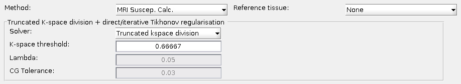

.. _method-qsm-mrisuscepcalc:
.. _qsm-mrisuscepcalc:
.. role::  raw-html(raw)
    :format: html

MRI Susceptibility Calculation Methods
======================================

Reference:
For the TKD software implementation, the following citation shall be included in the acknowledgements: Shmueli, K et al. (2009). Magnetic susceptibility mapping of brain tissue in vivo using MRI phase data, Magnetic Resonance in Medicine vol 62 issue 6, 1510-1522 and Schweser, F et al. (2013). Toward online reconstruction of quantitative susceptibility maps: superfast dipole inversion, Magnetic Resonance in Medicine vol 69 issue 6, 1581-1593.

For the dirTik and iterTik software implementations in the package, the following citation shall be included in the acknowledgements: Karsa, A et al. (2019). High Repeatability of Quantitative Susceptibility Mapping (QSM) in the Head and Neck With a View to Detecting Hypoxic Cancer Sites, In Proceedings of the 27th Annual Meeting of the ISMRM, Montreal, p. 4939 and Schweser, F et al. (2013). Toward online reconstruction of quantitative susceptibility maps: superfast dipole inversion, Magnetic Resonance in Medicine vol 69 issue 6, 1581-1593."

