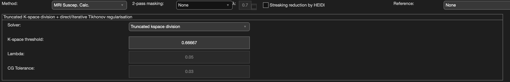

.. _method-qsm-mrisuscepcalc:
.. _qsm-mrisuscepcalc:
.. role::  raw-html(raw)
    :format: html

MRI Susceptibility Calculation Methods
======================================

Reference:
For the TKD software implementation, the following citation shall be included in the acknowledgements: Shmueli, K et al. (2009). Magnetic susceptibility mapping of brain tissue in vivo using MRI phase data, Magnetic Resonance in Medicine vol 62 issue 6, 1510-1522 and Schweser, F et al. (2013). Toward online reconstruction of quantitative susceptibility maps: superfast dipole inversion, Magnetic Resonance in Medicine vol 69 issue 6, 1581-1593.

For the dirTik and iterTik software implementations in the package, the following citation shall be included in the acknowledgements: Karsa, A et al. (2019). High Repeatability of Quantitative Susceptibility Mapping (QSM) in the Head and Neck With a View to Detecting Hypoxic Cancer Sites, In Proceedings of the 27th Annual Meeting of the ISMRM, Montreal, p. 4939 and Schweser, F et al. (2013). Toward online reconstruction of quantitative susceptibility maps: superfast dipole inversion, Magnetic Resonance in Medicine vol 69 issue 6, 1581-1593."

Algorithm parameters overview
-----------------------------

+---------------------------+------------------------------------------------------------------------------------------------------+
| algorParam.qsm.           | Description                                                                                          |
+===========================+======================================================================================================+
| solver                    | Method used for dipole field inversion. Options: 'Truncated kspace division', 'Direct Tikhonov',     |
|                           | 'Iterative Tikhonov'                                                                                 |
+---------------------------+------------------------------------------------------------------------------------------------------+
| threshold                 | Threshold for truncated k-space division (TKD); only relevant/enabled when solver is 'Truncated      |
|                           | kspace division'                                                                                     |
+---------------------------+------------------------------------------------------------------------------------------------------+
| lambda                    | Regularisation value for the Tikhonov algorithms; only relevant/enabled when solver is 'Direct       |
|                           | Tikhonov' or 'Iterative Tikhonov'                                                                    |
+---------------------------+------------------------------------------------------------------------------------------------------+
| tolerance                 | Conjugate gradient stopping tolerance; only relevant/enabled when solver is 'Iterative Tikhonov'     |
+---------------------------+------------------------------------------------------------------------------------------------------+

Usage
-----

algorParam.qsm.solver
^^^^^^^^^^^^^^^^^^^^^

Method used for dipole field inversion. Valid options are 'Truncated kspace division', 'Direct Tikhonov' and 'Iterative Tikhonov'. Selecting a solver enables the corresponding parameter(s) below in the GUI

**Default Value: 'Truncated kspace division'**

Examples:

``algorParam.qsm.solver = 'Truncated kspace division';``

``algorParam.qsm.solver = 'Direct Tikhonov';``

``algorParam.qsm.solver = 'Iterative Tikhonov';``

algorParam.qsm.threshold
^^^^^^^^^^^^^^^^^^^^^^^^

K-space threshold used for truncated k-space division (only relevant, and only enabled in the GUI, when algorParam.qsm.solver is 'Truncated kspace division')

**Default Value: 2/3 (0.6667)**

Examples:

``algorParam.qsm.threshold = 0.5;``

``algorParam.qsm.threshold = 2/3;``

``algorParam.qsm.threshold = 0.8;``

algorParam.qsm.lambda
^^^^^^^^^^^^^^^^^^^^^

Regularisation value used by the Tikhonov algorithms (only relevant, and only enabled in the GUI, when algorParam.qsm.solver is 'Direct Tikhonov' or 'Iterative Tikhonov')

**Default Value: 0.05**

Examples:

``algorParam.qsm.lambda = 0.01;``

``algorParam.qsm.lambda = 0.05;``

``algorParam.qsm.lambda = 0.1;``

algorParam.qsm.tolerance
^^^^^^^^^^^^^^^^^^^^^^^^

Conjugate gradient stopping tolerance (only relevant, and only enabled in the GUI, when algorParam.qsm.solver is 'Iterative Tikhonov')

**Default Value: 0.03**

Examples:

``algorParam.qsm.tolerance = 0.01;``

``algorParam.qsm.tolerance = 0.03;``

``algorParam.qsm.tolerance = 0.05;``

