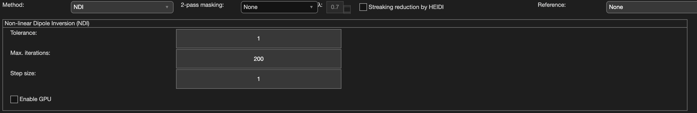

.. _method-qsm-ndi:
.. _qsm-ndi:
.. role::  raw-html(raw)
    :format: html

Nonlinear Dipole Inversion (NDI)
================================

Reference:
`Polak, D., Chatnuntawech, I., Yoon, J., Iyer, S.S., Milovic, C., Lee, J., Bachert, P., Adalsteinsson, E., Setsompop, K., Bilgic, B., 2020. Nonlinear dipole inversion (NDI) enables robust quantitative susceptibility mapping (QSM). Nmr Biomed e4271. <https://doi.org/10.1002/nbm.4271>`_ 

Algorithm parameters overview
------------------------------

+---------------------------+--------------------------------------------------------------------------------------------------------------+
| algorParam.qsm.           | Description                                                                                                  |
+===========================+==============================================================================================================+
| tol                       | Relative tolerance to stop NDI iteration                                                                     |
+---------------------------+--------------------------------------------------------------------------------------------------------------+
| maxiter                   | Maximum iterations allowed                                                                                   |
+---------------------------+--------------------------------------------------------------------------------------------------------------+
| stepSize                  | Gradient descent step size                                                                                   |
+---------------------------+--------------------------------------------------------------------------------------------------------------+
| isGPU                     | Enable GPU computation (true/false)                                                                          |
+---------------------------+--------------------------------------------------------------------------------------------------------------+

Usage
-----

algorParam.qsm.tol
^^^^^^^^^^^^^^^^^^

Relative tolerance to stop NDI iteration

**Default Value: 1**

Examples:

``algorParam.qsm.tol = 0.1;``

``algorParam.qsm.tol = 1;``

``algorParam.qsm.tol = 10;``

algorParam.qsm.maxiter
^^^^^^^^^^^^^^^^^^^^^^

Maximum iterations allowed

**Default Value: 200**

Examples:

``algorParam.qsm.maxiter = 100;``

``algorParam.qsm.maxiter = 200;``

``algorParam.qsm.maxiter = 400;``

algorParam.qsm.stepSize
^^^^^^^^^^^^^^^^^^^^^^^

Gradient descent step size

**Default Value: 1**

Examples:

``algorParam.qsm.stepSize = 0.5;``

``algorParam.qsm.stepSize = 1;``

``algorParam.qsm.stepSize = 2;``

algorParam.qsm.isGPU
^^^^^^^^^^^^^^^^^^^^

Enable GPU computation to accelerate the NDI iterative reconstruction

**Default Value: false**

Examples:

``algorParam.qsm.isGPU = false;``

``algorParam.qsm.isGPU = true;``
