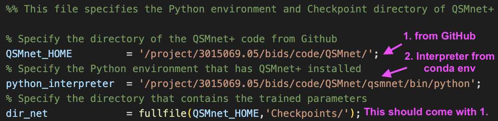

.. _method-qsm-qsmnet:
.. _qsm-qsmnet:
.. role::  raw-html(raw)
    :format: html

QSMnet+
=======

Reference:
`J. Yoon, E. Gong, I. Chatnuntawech, B. Bilgic, J. Lee, W. Jung, J. Ko, H. Jung, K. Setsompop, G. Zaharchuk, E.Y. Kim, J. Pauly, J. Lee. Quantitative susceptibility mapping using deep neural network: QSMnet. Neuroimage. 2018 Oct;179:199-206. <https://www.sciencedirect.com/science/article/pii/S1053811918305378>`_ 

`W. Jung, J. Yoon, S. Ji, J. Choi, J. Kim, Y. Nam, E. Kim, J. Lee. Exploring linearity of deep neural network trained QSM: QSMnet+. Neuroimage. 2020 May; 116619. <https://www.sciencedirect.com/science/article/pii/S1053811920301063>`_ 

`W. Jung, S. Bollmann, J. Lee. Overview of quantitative susceptibility mapping using deep learning: Current status, challenges and opportunities. NMR in Biomedicine. 2020 Mar; e4292. <https://doi.org/10.1002/nbm.4292>`_ 

Setup QSMnet+ for SEPIA
-----------------------
1. Download `QSMnet+ <https://github.com/SNU-LIST/QSMnet>`_ from GitHub
2. If you haven't setup QSMnet+ in python, following the instruction in https://github.com/SNU-LIST/QSMnet, including downloading the pre-trained network and creating conda environment (see Section Manual in their GitHub page)
3. Specify the full path to QSMnet+ code as 'QSMnet_HOME' in setup_qsmnet_environment.m in SEPIA_HOME/addons/qsm/QSMnet/
4. Specify the full path of the Python interpreter that has QSMnet installed as 'python_interpreter' in setup_qsmnet_environment.m

Your setup_qsmnet_environment.m should look something like this:

.. warning::
The support this method is still in an early stage and only tested on a Linux machine.

QSMnet+ panel
-------------
There is no algorithm parameter needed to be adjusted with this tool at the moment.

.. image:: ../images/qsm/QSMnet.png
