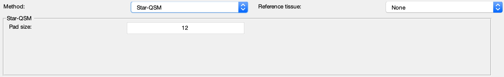

.. _method-qsm-starqsm:
.. _qsm-starqsm:
.. role::  raw-html(raw)
    :format: html

STreaking Artifact Reduction for QSM (Star-QSM)
===============================================

Reference:
`Wei, H., Dibb, R., Zhou, Y., Sun, Y., Xu, J., Wang, N., Liu, C., 2015. Streaking artifact reduction for quantitative susceptibility mapping of sources with large dynamic range. NMR in biomedicine 28, 1294–1303. <https://doi.org/10.1002/nbm.3383>`_ 

