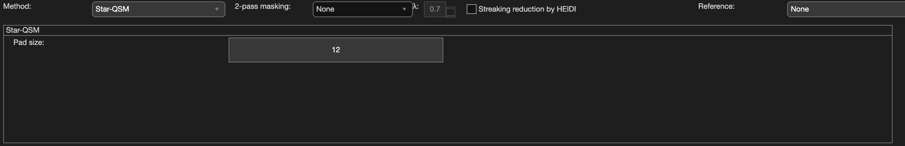

.. _method-qsm-starqsm:
.. _qsm-starqsm:
.. role::  raw-html(raw)
    :format: html

STreaking Artifact Reduction for QSM (Star-QSM)
===============================================

Reference:
`Wei, H., Dibb, R., Zhou, Y., Sun, Y., Xu, J., Wang, N., Liu, C., 2015. Streaking artifact reduction for quantitative susceptibility mapping of sources with large dynamic range. NMR in biomedicine 28, 1294–1303. <https://doi.org/10.1002/nbm.3383>`_ 

Algorithm parameters overview
------------------------------

+---------------------------+--------------------------------------------------------------------------------------------------------------+
| algorParam.qsm.           | Description                                                                                                  |
+===========================+==============================================================================================================+
| padsize                   | Zero padding size                                                                                            |
+---------------------------+--------------------------------------------------------------------------------------------------------------+

Usage
-----

algorParam.qsm.padsize
^^^^^^^^^^^^^^^^^^^^^^

Zero padding size, specified isotropically in the GUI (the same value is applied to all three dimensions, e.g. a GUI value of 12 sets ``algorParam.qsm.padsize = [12,12,12]``)

**Default Value: [12,12,12]**

Examples:

``algorParam.qsm.padsize = [0,0,0];``

``algorParam.qsm.padsize = [8,8,8];``

``algorParam.qsm.padsize = [12,12,12];``
