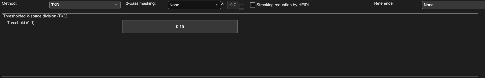

.. _method-qsm-tkd:
.. _qsm-tkd:
.. role::  raw-html(raw)
    :format: html

Thresholded k-space Division (TKD)
==================================

Reference:
`Wharton, S., Schäfer, A., Bowtell, R., 2010. Susceptibility mapping in the human brain using threshold-based k-space division. Magnetic resonance in medicine 63, 1292–1304. <https://doi.org/10.1002/mrm.22334>`_

Algorithm parameters overview
------------------------------

+---------------------------+--------------------------------------------------------------------------------------------------------------+
| algorParam.qsm.           | Description                                                                                                  |
+===========================+==============================================================================================================+
| threshold                 | K-space threshold (0-1)                                                                                      |
+---------------------------+--------------------------------------------------------------------------------------------------------------+

Usage
-----

algorParam.qsm.threshold
^^^^^^^^^^^^^^^^^^^^^^^^

K-space threshold (0-1)

**Default Value: 0.15**

Examples:

``algorParam.qsm.threshold = 0.1;``

``algorParam.qsm.threshold = 0.15;``

``algorParam.qsm.threshold = 0.2;``
