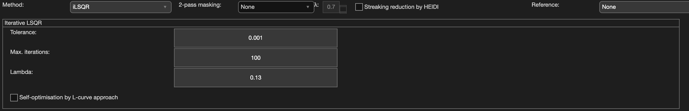

.. _method-qsm-ilsqr:
.. _qsm-ilsqr:
.. role::  raw-html(raw)
    :format: html

Iterative LSQR (iLSQR)
======================

Reference:
`Li, W., Wu, B., Liu, C., 2011. Quantitative susceptibility mapping of human brain reflects spatial variation in tissue composition. Neuroimage 55, 1645–1656. <https://doi.org/10.1016/j.neuroimage.2010.11.088>`_

Algorithm parameters overview
------------------------------

+---------------------------+--------------------------------------------------------------------------------------------------------------+
| algorParam.qsm.           | Description                                                                                                  |
+===========================+==============================================================================================================+
| tol                       | Relative tolerance to stop LSQR iteration                                                                    |
+---------------------------+--------------------------------------------------------------------------------------------------------------+
| maxiter                   | Maximum iterations allowed                                                                                   |
+---------------------------+--------------------------------------------------------------------------------------------------------------+
| lambda                    | Regularisation parameter to control spatial smoothness of QSM                                                |
+---------------------------+--------------------------------------------------------------------------------------------------------------+
| optimise                  | Self estimation of lambda based on L-curve approach (true/false)                                             |
+---------------------------+--------------------------------------------------------------------------------------------------------------+

Usage
-----

algorParam.qsm.tol
^^^^^^^^^^^^^^^^^^

Relative tolerance to stop LSQR iteration

**Default Value: 0.001**

Examples:

``algorParam.qsm.tol = 0.01;``

``algorParam.qsm.tol = 0.001;``

``algorParam.qsm.tol = 0.0001;``

algorParam.qsm.maxiter
^^^^^^^^^^^^^^^^^^^^^^

Maximum iterations allowed

**Default Value: 100**

Examples:

``algorParam.qsm.maxiter = 50;``

``algorParam.qsm.maxiter = 100;``

``algorParam.qsm.maxiter = 200;``

algorParam.qsm.lambda
^^^^^^^^^^^^^^^^^^^^^

Regularisation parameter to control spatial smoothness of QSM. This parameter is only used when ``algorParam.qsm.optimise`` is set to ``false``; when self-optimisation is enabled the edit field is disabled and this value is ignored.

**Default Value: 0.13**

Examples:

``algorParam.qsm.lambda = 0.05;``

``algorParam.qsm.lambda = 0.13;``

``algorParam.qsm.lambda = 0.5;``

algorParam.qsm.optimise
^^^^^^^^^^^^^^^^^^^^^^^

Self estimation of lambda based on an L-curve approach. When set to ``true``, ``algorParam.qsm.lambda`` is automatically determined and its GUI edit field is disabled; when set to ``false``, the value specified in ``algorParam.qsm.lambda`` is used directly.

**Default Value: false**

Examples:

``algorParam.qsm.optimise = false;``

``algorParam.qsm.optimise = true;``
