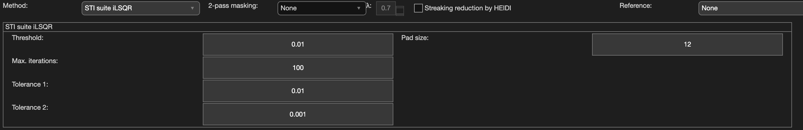

.. _method-qsm-ilsqrstisuite:
.. _qsm-ilsqrstisuite:
.. role::  raw-html(raw)
    :format: html

Iterative LSQR (iLSQR STI Suite)
================================

Reference:
`Li, W., Wu, B., Liu, C., 2011. Quantitative susceptibility mapping of human brain reflects spatial variation in tissue composition. Neuroimage 55, 1645–1656. <https://doi.org/10.1016/j.neuroimage.2010.11.088>`_ 

Algorithm parameters overview
------------------------------

+---------------------------+--------------------------------------------------------------------------------------------------------------+
| algorParam.qsm.           | Description                                                                                                  |
+===========================+==============================================================================================================+
| threshold                 | Threshold on the dipole kernel                                                                               |
+---------------------------+--------------------------------------------------------------------------------------------------------------+
| maxiter                   | Maximum no. of iterations allowed                                                                            |
+---------------------------+--------------------------------------------------------------------------------------------------------------+
| tol1                      | Iteration stopping criteria at first level                                                                   |
+---------------------------+--------------------------------------------------------------------------------------------------------------+
| tol2                      | Iteration stopping criteria at second level                                                                  |
+---------------------------+--------------------------------------------------------------------------------------------------------------+
| padsize                   | Array size for zero padding                                                                                  |
+---------------------------+--------------------------------------------------------------------------------------------------------------+

Usage
-----

algorParam.qsm.threshold
^^^^^^^^^^^^^^^^^^^^^^^^

Threshold on the dipole kernel

**Default Value: 0.01**

Examples:

``algorParam.qsm.threshold = 0.01;``

``algorParam.qsm.threshold = 0.05;``

``algorParam.qsm.threshold = 0.1;``

algorParam.qsm.maxiter
^^^^^^^^^^^^^^^^^^^^^^

Maximum no. of iterations allowed

**Default Value: 100**

Examples:

``algorParam.qsm.maxiter = 50;``

``algorParam.qsm.maxiter = 100;``

``algorParam.qsm.maxiter = 200;``

algorParam.qsm.tol1
^^^^^^^^^^^^^^^^^^^

Iteration stopping criteria at first level

**Default Value: 0.01**

Examples:

``algorParam.qsm.tol1 = 0.1;``

``algorParam.qsm.tol1 = 0.01;``

``algorParam.qsm.tol1 = 0.001;``

algorParam.qsm.tol2
^^^^^^^^^^^^^^^^^^^

Iteration stopping criteria at second level

**Default Value: 0.001**

Examples:

``algorParam.qsm.tol2 = 0.01;``

``algorParam.qsm.tol2 = 0.001;``

``algorParam.qsm.tol2 = 0.0001;``

algorParam.qsm.padsize
^^^^^^^^^^^^^^^^^^^^^^

Array size for zero padding, specified isotropically in the GUI (the same value is applied to all three dimensions, e.g. a GUI value of 12 sets ``algorParam.qsm.padsize = [12,12,12]``)

**Default Value: [12,12,12]**

Examples:

``algorParam.qsm.padsize = [0,0,0];``

``algorParam.qsm.padsize = [8,8,8];``

``algorParam.qsm.padsize = [12,12,12];``
