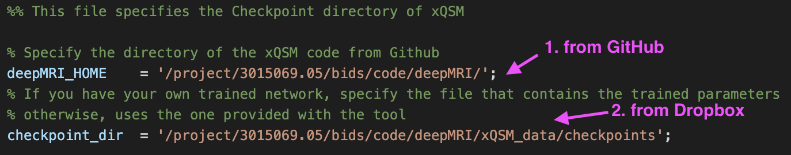
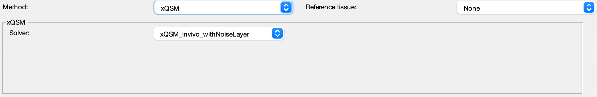

.. _method-qsm-xqsm:
.. _qsm-xqsm:
.. role::  raw-html(raw)
    :format: html

xQSM
====

Reference:
`Yang Gao, Xuanyu Zhu, Bradford A. Moffat, Rebecca Glarin, Alan H. Wilman, G. Bruce Pike, Stuart Crozier, Feng Liu, Hongfu Sun, 2020. xQSM: quantitative susceptibility mapping with octave convolutional and noise-regularized neural networks. <https://doi.org/10.1002/nbm.4461>`_ 

Setup xQSM for SEPIA
----------------------
1. Download `deepMRI <https://github.com/sunhongfu/deepMRI>`_ from GitHub
2. Download the pre-trained xQSM `here <https://www.dropbox.com/sh/weps2m849svsh93/AAAAPqqKcLkL10Arqhy-3h_Fa?dl=0>`_ as mentioned in the instruction on GitHub
3. Specify the full path to deepMRI code as 'deepMRI_HOME' in setup_xQSM_environment.m in SEPIA_HOME/addons/qsm/xQSM/
4. Specify the full path to the folder containing the pre-trained networks (should be checkpoints/) from (2) as 'checkpoints_dir' in setup_xQSM_environment.m

Your setup_xQSM_environment.m should look something like this:

.. warning::
The support this method is still in an early stage and only tested on a Linux machine.

xQSM panel
----------
In the xQSM panel you can select one of the five provided pre-trained networks.

