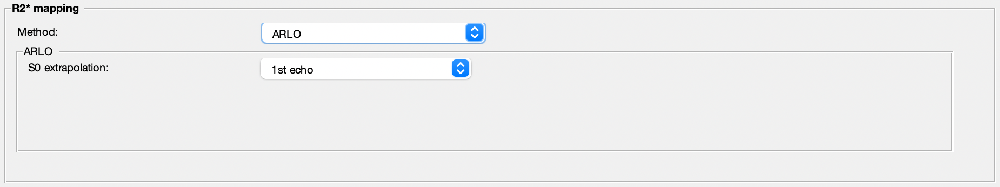

.. _method-r2s-arlo:
.. role::  raw-html(raw)
    :format: html

Algorithm for fast monoexponential fitting based on Auto-Regression on Linear Operations (ARLO) of data
=======================================================================================================

`Pei, M., Nguyen, T.D., Thimmappa, N.D., Salustri, C., Dong, F., Cooper, M.A., Li, J., Prince, M.R., Wang, Y., 2014. Algorithm for fast monoexponential fitting based on Auto-Regression on Linear Operations (ARLO) of data. Magnetic resonance in medicine 73, 843–850. <https://doi.org/10.1002/mrm.25137>`_ 

