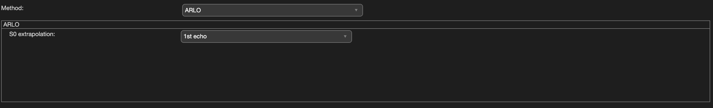

.. _method-r2s-arlo:
.. role::  raw-html(raw)
    :format: html

Algorithm for fast monoexponential fitting based on Auto-Regression on Linear Operations (ARLO) of data
=======================================================================================================

`Pei, M., Nguyen, T.D., Thimmappa, N.D., Salustri, C., Dong, F., Cooper, M.A., Li, J., Prince, M.R., Wang, Y., 2014. Algorithm for fast monoexponential fitting based on Auto-Regression on Linear Operations (ARLO) of data. Magnetic resonance in medicine 73, 843–850. <https://doi.org/10.1002/mrm.25137>`_ 

Algorithm parameters overview
-----------------------------

+-----------------+------------------------------------------------------------------------------------------------+
| algorParam.r2s. | Description                                                                                    |
+=================+================================================================================================+
| s0mode          | Method to extrapolate the T1-weighted magnitude signal (S0) from the multi-echo magnitude data |
+-----------------+------------------------------------------------------------------------------------------------+

Usage
-----

algorParam.r2s.s0mode
^^^^^^^^^^^^^^^^^^^^^

Method to extrapolate the T1-weighted magnitude signal (S0) from the multi-echo magnitude data. Options are ``'1st echo'`` (use the first echo intensity directly), ``'weighted sum'`` (signal-intensity-weighted combination across echoes) and ``'averaging'`` (average of the echo-time-corrected signal across echoes)

**Default Value: '1st echo'**

Examples:

``algorParam.r2s.s0mode = '1st echo';``

``algorParam.r2s.s0mode = 'weighted sum';``

``algorParam.r2s.s0mode = 'averaging';``
