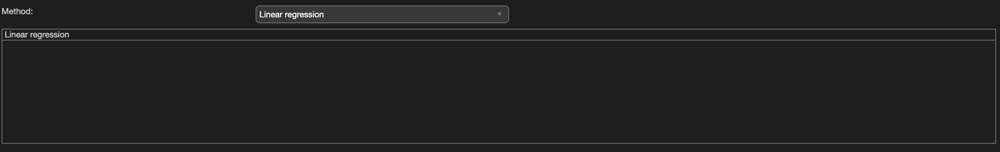

.. _method-r2s-linear:
.. role::  raw-html(raw)
    :format: html

Linear regression
=================

Mono-exponential R2* fitting with a linear model (in Logarithm space)

Algorithm parameters overview
-----------------------------

+-----------------+-------------------------------------------------------------------------+
| algorParam.r2s. | Description                                                             |
+=================+=========================================================================+
| isParallel      | Enable parallel computing (parfor) to accelerate the voxel-wise fitting |
+-----------------+-------------------------------------------------------------------------+

Usage
-----

algorParam.r2s.isParallel
^^^^^^^^^^^^^^^^^^^^^^^^^

Enable parallel computing (parfor) to accelerate the voxel-wise fitting

**Default Value: false**

Examples:

``algorParam.r2s.isParallel = false;``

``algorParam.r2s.isParallel = true;``
