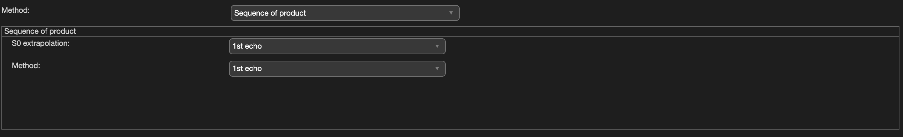

.. _method-r2s-pi:
.. role::  raw-html(raw)
    :format: html

Closed-form solution using Sequence of Product
==============================================

There is no reference for this method. I created this to test different closed-form solution.

Algorithm parameters overview
-----------------------------

+-----------------+--------------------------------------------------------------------------------------------------------------------------------------------------------------+
| algorParam.r2s. | Description                                                                                                                                                  |
+=================+==============================================================================================================================================================+
| s0mode          | Method to extrapolate the T1-weighted magnitude signal (S0) from the multi-echo magnitude data                                                               |
+-----------------+--------------------------------------------------------------------------------------------------------------------------------------------------------------+
| piMethod        | Method to compute R2* using the sequence of product approach: ratio between the first echo and each subsequent echo, or ratio between consecutive echo pairs |
+-----------------+--------------------------------------------------------------------------------------------------------------------------------------------------------------+

Usage
-----

algorParam.r2s.s0mode
^^^^^^^^^^^^^^^^^^^^^

Method to extrapolate the T1-weighted magnitude signal (S0) from the multi-echo magnitude data. Options are ``'1st echo'`` (use the first echo intensity directly), ``'weighted sum'`` (signal-intensity-weighted combination across echoes) and ``'averaging'`` (average of the echo-time-corrected signal across echoes)

**Default Value: '1st echo'**

Examples:

``algorParam.r2s.s0mode = '1st echo';``

``algorParam.r2s.s0mode = 'weighted sum';``

``algorParam.r2s.s0mode = 'averaging';``

algorParam.r2s.piMethod
^^^^^^^^^^^^^^^^^^^^^^^

Method to compute R2* using the sequence of product approach. ``'1st echo'`` uses the ratio between the first echo and each subsequent echo; ``'interleaved'`` uses the ratio between consecutive echo pairs

**Default Value: 'interleaved'**

Examples:

``algorParam.r2s.piMethod = '1st echo';``

``algorParam.r2s.piMethod = 'interleaved';``
