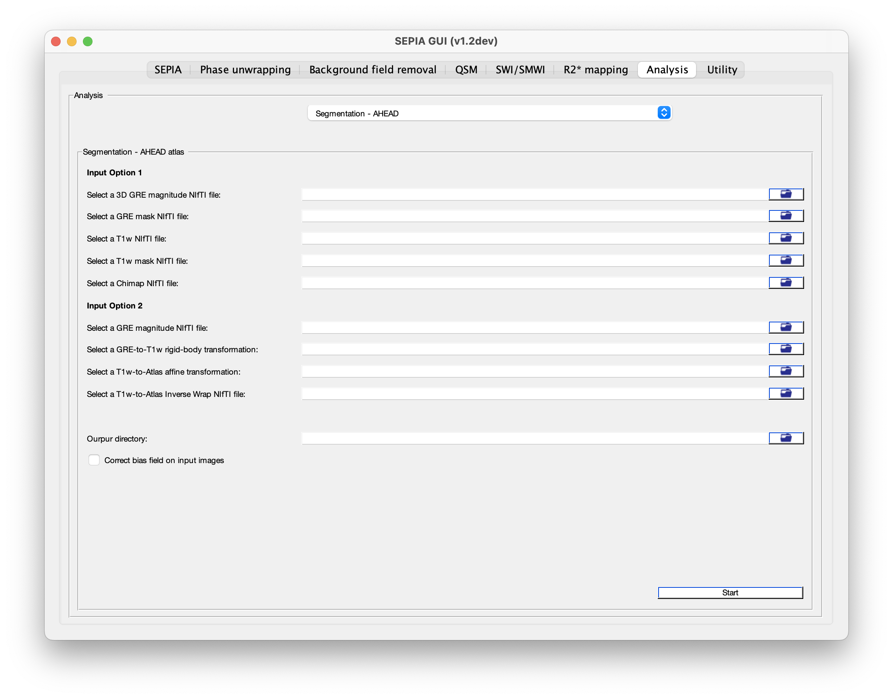

.. _method-segmentation-ahead:
.. role::  raw-html(raw)
    :format: html

Amsterdam Ultra-high field adult lifespan database (AHEAD) atlas
================================================================

`Alkemade, A., Mulder, M.J., Groot, J.M., Isaacs, B.R., Berendonk, N. van, Lute, N., Isherwood, S.J., Bazin, P.-L., Forstmann, B.U., 2020. The Amsterdam Ultra-high field adult lifespan database (AHEAD): A freely available multimodal 7 Tesla submillimeter magnetic resonance imaging database. Neuroimage 221, 117200. <https://doi.org/10.1016/j.neuroimage.2020.117200>`_ 

For details regarding the atlas and labels, please refer to the reference above.

.. note:: 
    The AHEAD atlas has very high resolution (0.5 mm isotropic). It will take longer compared to other atlas to obtain the labels.

There are two possible approaches to bring the atlas labels to the GRE space, which approach will be used depending on the input of the user.

Approach 1: Proving NIFTI data input
------------------------------------

Data required:

- a 3D GRE magnitude NIFTI image (e.g. 1st echo)
- a 3D GRE NIFTI brain mask
- a T1w NIFTI images
- a T1w NIFTI brain mask 
- a Chimap NIFTI image

Procedures:

1. (optional) Bias field correction on both T1w and GRE image using N4BiasFieldCorrection.

2. Coregistration between GRE image and T1w image using rigid-body transformation.

3. Bringing Chimap to T1w space and create a hybrid image using the following equation:

    .. math::
        hybrid = T1w - \mu Chi
        :label: hybrid

    where T1w is the T1w image normalised to range [0,255] (clipped at 0.5 and 99.5 percentile of masked voxels), mu = 400 and Chi is the magnetic susceptibility map in ppm.

4. Create a hybrid image in the template space using the median R1 and Chi maps using the same equation as above.

5. Coregistration between the hybrid image and the template hybrid image provided with the atlas using nonlinear transformation (SyN).

6. Applying the derived transformation matrices to bring the atlas labels to the GRE space.

Approach 2: Proving the transformation information derived from ANTs
--------------------------------------------------------------------

Data required:

- a 3D GRE NIFTI image (to define the final space only)
- a GRE to T1w rigid-body transformation matrix file (usually with suffix *_0GenericAffine.mat*)
- a T1w to atlas T1w template affine transformation matrix file (usually with suffix *_0GenericAffine.mat*)
- a T1w to atlas T1w template inverse wrap field (usually with suffix *_1InverseWarp.nii.gz*)

Procedure:

1. The provided transformation information is used to bring the atlas labels to the GRE space.
