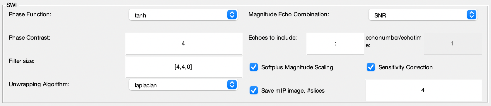

.. _method-swi-clearswi:
.. _swi-clearswi:
.. role::  raw-html(raw)
    :format: html

CLEAR-SWI
=========

Reference:
`Korbinian Eckstein, Beata Bachrata, Gilbert Hangel, Georg Widhalm, Christian Enzinger, Markus Barth, Siegfried Trattnig, Simon Daniel Robinson, 2021. Improved susceptibility weighted imaging at ultra-high field using bipolar multi-echo acquisition and optimized image processing: CLEAR-SWI <https://doi.org/10.1016/j.neuroimage.2021.118175>`_ 

Pleas refer to https://github.com/korbinian90/CLEARSWI.jl to see more information regarding the options/parameters of this method.
