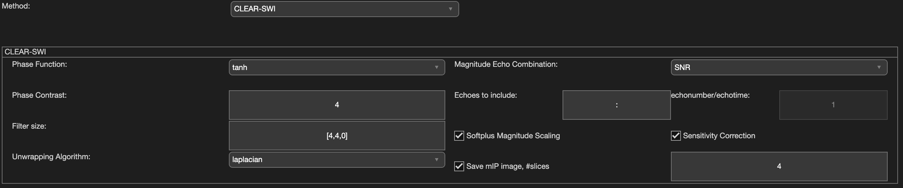

.. _method-swi-clearswi:
.. _swi-clearswi:
.. role::  raw-html(raw)
    :format: html

CLEAR-SWI
=========

Reference:
`Korbinian Eckstein, Beata Bachrata, Gilbert Hangel, Georg Widhalm, Christian Enzinger, Markus Barth, Siegfried Trattnig, Simon Daniel Robinson, 2021. Improved susceptibility weighted imaging at ultra-high field using bipolar multi-echo acquisition and optimized image processing: CLEAR-SWI <https://doi.org/10.1016/j.neuroimage.2021.118175>`_ 

Pleas refer to https://github.com/korbinian90/CLEARSWI.jl to see more information regarding the options/parameters of this method.

Algorithm parameters overview
------------------------------

+-----------------------+------------------------------------------------------------------------------------------------------------------------------------------+
| algorParam.swismwi.   | Description                                                                                                                              |
+=======================+==========================================================================================================================================+
| phaseScalingType      | Shape of the phase scaling function used to build the phase mask (options: 'tanh', 'negativetanh', 'positive', 'negative', 'triangular') |
+-----------------------+------------------------------------------------------------------------------------------------------------------------------------------+
| phaseScalingStrength  | Strength (contrast) of the phase scaling function applied to build the phase mask                                                        |
+-----------------------+------------------------------------------------------------------------------------------------------------------------------------------+
| filterSize            | Size of the background high-pass filter kernel, specified as [x,y,z] in voxels                                                           |
+-----------------------+------------------------------------------------------------------------------------------------------------------------------------------+
| unwrappingAlgorithm   | Phase unwrapping algorithm used before background removal (options: 'laplacian', 'romeo', 'laplacianslice')                              |
+-----------------------+------------------------------------------------------------------------------------------------------------------------------------------+
| echoCombineMethod     | Method used to combine the magnitude images across echoes (options: 'SNR', 'average', 'echo', 'simulated echo')                          |
+-----------------------+------------------------------------------------------------------------------------------------------------------------------------------+
| echoCombineMethodAdd  | Additional parameter required when echoCombineMethod is 'echo' or 'simulated echo' (echo number or echo time)                            |
+-----------------------+------------------------------------------------------------------------------------------------------------------------------------------+
| echoes                | Echoes included in the SWI computation, specified using MATLAB indexing notation (e.g. ':' for all echoes)                               |
+-----------------------+------------------------------------------------------------------------------------------------------------------------------------------+
| softplusScaling       | Apply a softplus function to scale the magnitude image for improved contrast                                                             |
+-----------------------+------------------------------------------------------------------------------------------------------------------------------------------+
| sensitivityCorrection | Apply coil sensitivity correction to the magnitude image                                                                                 |
+-----------------------+------------------------------------------------------------------------------------------------------------------------------------------+
| ismIP                 | Enable minimum intensity projection (mIP) of the CLEAR-SWI image over a number of slices                                                 |
+-----------------------+------------------------------------------------------------------------------------------------------------------------------------------+
| slice_mIP             | Number of slices used to compute the minimum intensity projection (mIP), when ismIP is enabled                                           |
+-----------------------+------------------------------------------------------------------------------------------------------------------------------------------+

Usage
-----

algorParam.swismwi.phaseScalingType
^^^^^^^^^^^^^^^^^^^^^^^^^^^^^^^^^^^

Shape of the phase scaling function used to build the phase mask

**Default Value: 'tanh'**

Examples:

``algorParam.swismwi.phaseScalingType = 'tanh';``

``algorParam.swismwi.phaseScalingType = 'negativetanh';``

``algorParam.swismwi.phaseScalingType = 'triangular';``

algorParam.swismwi.phaseScalingStrength
^^^^^^^^^^^^^^^^^^^^^^^^^^^^^^^^^^^^^^^

Strength (contrast) of the phase scaling function applied to build the phase mask

**Default Value: 4**

Examples:

``algorParam.swismwi.phaseScalingStrength = 2;``

``algorParam.swismwi.phaseScalingStrength = 4;``

``algorParam.swismwi.phaseScalingStrength = 8;``

algorParam.swismwi.filterSize
^^^^^^^^^^^^^^^^^^^^^^^^^^^^^

Size of the background high-pass filter kernel, specified as [x,y,z] in voxels

**Default Value: '[4,4,0]'**

Examples:

``algorParam.swismwi.filterSize = '[2,2,0]';``

``algorParam.swismwi.filterSize = '[4,4,0]';``

``algorParam.swismwi.filterSize = '[6,6,0]';``

algorParam.swismwi.unwrappingAlgorithm
^^^^^^^^^^^^^^^^^^^^^^^^^^^^^^^^^^^^^^

Phase unwrapping algorithm used before background removal

**Default Value: 'laplacian'**

Examples:

``algorParam.swismwi.unwrappingAlgorithm = 'laplacian';``

``algorParam.swismwi.unwrappingAlgorithm = 'romeo';``

``algorParam.swismwi.unwrappingAlgorithm = 'laplacianslice';``

algorParam.swismwi.echoCombineMethod
^^^^^^^^^^^^^^^^^^^^^^^^^^^^^^^^^^^^

Method used to combine the magnitude images across echoes

**Default Value: 'SNR'**

Examples:

``algorParam.swismwi.echoCombineMethod = 'SNR';``

``algorParam.swismwi.echoCombineMethod = 'average';``

``algorParam.swismwi.echoCombineMethod = 'echo';``

algorParam.swismwi.echoCombineMethodAdd
^^^^^^^^^^^^^^^^^^^^^^^^^^^^^^^^^^^^^^^

Additional parameter required when echoCombineMethod is 'echo' or 'simulated echo' (specifies the echo number or echo time). This field is disabled in the GUI unless echoCombineMethod is set to 'echo' or 'simulated echo'.

**Default Value: '' (empty)**

Examples:

``algorParam.swismwi.echoCombineMethodAdd = '1';``

``algorParam.swismwi.echoCombineMethodAdd = '2';``

algorParam.swismwi.echoes
^^^^^^^^^^^^^^^^^^^^^^^^^

Echoes included in the SWI computation, specified using MATLAB indexing notation

**Default Value: ':'**

Examples:

``algorParam.swismwi.echoes = ':';``

``algorParam.swismwi.echoes = '1:3';``

``algorParam.swismwi.echoes = '2';``

algorParam.swismwi.softplusScaling
^^^^^^^^^^^^^^^^^^^^^^^^^^^^^^^^^^

Apply a softplus function to scale the magnitude image for improved contrast

**Default Value: true**

Examples:

``algorParam.swismwi.softplusScaling = true;``

``algorParam.swismwi.softplusScaling = false;``

algorParam.swismwi.sensitivityCorrection
^^^^^^^^^^^^^^^^^^^^^^^^^^^^^^^^^^^^^^^^

Apply coil sensitivity correction to the magnitude image

**Default Value: true**

Examples:

``algorParam.swismwi.sensitivityCorrection = true;``

``algorParam.swismwi.sensitivityCorrection = false;``

algorParam.swismwi.ismIP
^^^^^^^^^^^^^^^^^^^^^^^^

Enable minimum intensity projection (mIP) of the CLEAR-SWI image over a number of slices

**Default Value: true**

Examples:

``algorParam.swismwi.ismIP = true;``

``algorParam.swismwi.ismIP = false;``

algorParam.swismwi.slice_mIP
^^^^^^^^^^^^^^^^^^^^^^^^^^^^

Number of slices used to compute the minimum intensity projection (mIP), when ismIP is enabled

**Default Value: 4**

Examples:

``algorParam.swismwi.slice_mIP = 2;``

``algorParam.swismwi.slice_mIP = 4;``

``algorParam.swismwi.slice_mIP = 8;``
