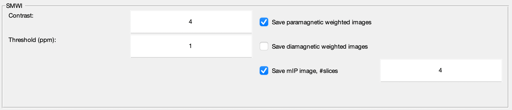

.. _method-swi-smwi:
.. _swi-smwi:
.. role::  raw-html(raw)
    :format: html

SMWI
====

Reference:
`Gho, S.-M., Liu, C., Li, W., Jang, U., Kim, E.Y., Hwang, D., Kim, D.-H., 2014. Susceptibility map-weighted imaging (SMWI) for neuroimaging. Magnetic resonance in medicine 72, 337–346. <https://doi.org/10.1002/mrm.24920>`_ 

