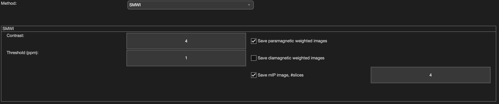

.. _method-swi-smwi:
.. _swi-smwi:
.. role::  raw-html(raw)
    :format: html

SMWI
====

Reference:
`Gho, S.-M., Liu, C., Li, W., Jang, U., Kim, E.Y., Hwang, D., Kim, D.-H., 2014. Susceptibility map-weighted imaging (SMWI) for neuroimaging. Magnetic resonance in medicine 72, 337–346. <https://doi.org/10.1002/mrm.24920>`_ 

Algorithm parameters overview
------------------------------

+---------------------+----------------------------------------------------------------------------------------------------------------------------------------+
| algorParam.swismwi. | Description                                                                                                                            |
+=====================+========================================================================================================================================+
| m                   | Power to which the phase mask (derived from the susceptibility map) is raised, controlling the contrast/strength of the weighting mask |
+---------------------+----------------------------------------------------------------------------------------------------------------------------------------+
| threshold           | Susceptibility threshold (in ppm) used to build the paramagnetic/diamagnetic weighting mask from the susceptibility map                |
+---------------------+----------------------------------------------------------------------------------------------------------------------------------------+
| ismIP               | Enable minimum intensity projection (mIP) of the SMWI image over a number of slices                                                    |
+---------------------+----------------------------------------------------------------------------------------------------------------------------------------+
| slice_mIP           | Number of slices used to compute the minimum intensity projection (mIP), when ismIP is enabled                                         |
+---------------------+----------------------------------------------------------------------------------------------------------------------------------------+
| isParamagnetic      | Save the paramagnetic weighted images                                                                                                  |
+---------------------+----------------------------------------------------------------------------------------------------------------------------------------+
| isDiamagnetic       | Save the diamagnetic weighted images                                                                                                   |
+---------------------+----------------------------------------------------------------------------------------------------------------------------------------+

Usage
-----

algorParam.swismwi.m
^^^^^^^^^^^^^^^^^^^^

Power to which the phase mask (derived from the susceptibility map) is raised, controlling the contrast/strength of the weighting mask

**Default Value: 4**

Examples:

``algorParam.swismwi.m = 1;``

``algorParam.swismwi.m = 4;``

``algorParam.swismwi.m = 8;``

algorParam.swismwi.threshold
^^^^^^^^^^^^^^^^^^^^^^^^^^^^

Susceptibility threshold (in ppm) used to build the paramagnetic/diamagnetic weighting mask from the susceptibility map

**Default Value: 1**

Examples:

``algorParam.swismwi.threshold = 0.5;``

``algorParam.swismwi.threshold = 1;``

``algorParam.swismwi.threshold = 2;``

algorParam.swismwi.ismIP
^^^^^^^^^^^^^^^^^^^^^^^^

Enable minimum intensity projection (mIP) of the SMWI image over a number of slices

**Default Value: true**

Examples:

``algorParam.swismwi.ismIP = true;``

``algorParam.swismwi.ismIP = false;``

algorParam.swismwi.slice_mIP
^^^^^^^^^^^^^^^^^^^^^^^^^^^^

Number of slices used to compute the minimum intensity projection (mIP), when ismIP is enabled

**Default Value: 4**

Examples:

``algorParam.swismwi.slice_mIP = 2;``

``algorParam.swismwi.slice_mIP = 4;``

``algorParam.swismwi.slice_mIP = 8;``

algorParam.swismwi.isParamagnetic
^^^^^^^^^^^^^^^^^^^^^^^^^^^^^^^^^

Save the paramagnetic weighted images

**Default Value: true**

Examples:

``algorParam.swismwi.isParamagnetic = true;``

``algorParam.swismwi.isParamagnetic = false;``

algorParam.swismwi.isDiamagnetic
^^^^^^^^^^^^^^^^^^^^^^^^^^^^^^^^

Save the diamagnetic weighted images

**Default Value: false**

Examples:

``algorParam.swismwi.isDiamagnetic = true;``

``algorParam.swismwi.isDiamagnetic = false;``
