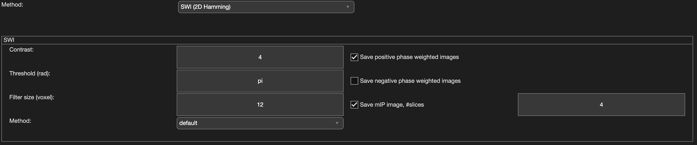

.. _method-swi-swi2dhamming:
.. _swi-swi2dhamming:
.. role::  raw-html(raw)
    :format: html

SWI (2D Hamming)
================

Algorithm parameters overview
------------------------------

+---------------------+----------------------------------------------------------------------------------------------------------------------------------+
| algorParam.swismwi. | Description                                                                                                                      |
+=====================+==================================================================================================================================+
| m                   | Power to which the phase mask is raised, controlling the contrast/strength of the phase weighting applied to the magnitude image |
+---------------------+----------------------------------------------------------------------------------------------------------------------------------+
| threshold           | Phase threshold (in radians) used to build the phase mask from the unwrapped/high-pass filtered phase                            |
+---------------------+----------------------------------------------------------------------------------------------------------------------------------+
| filterSize          | Size of the 2D low-pass (Hamming) filter kernel, in voxels, used to remove the background phase before computing the phase mask  |
+---------------------+----------------------------------------------------------------------------------------------------------------------------------+
| method              | Echo/phase combination method used to compute the SWI phase mask                                                                 |
+---------------------+----------------------------------------------------------------------------------------------------------------------------------+
| ismIP               | Enable minimum intensity projection (mIP) of the SWI image over a number of slices                                               |
+---------------------+----------------------------------------------------------------------------------------------------------------------------------+
| slice_mIP           | Number of slices used to compute the minimum intensity projection (mIP), when ismIP is enabled                                   |
+---------------------+----------------------------------------------------------------------------------------------------------------------------------+
| isPositive          | Save the positive (bright, e.g. paramagnetic contrast) phase-weighted SWI images                                                 |
+---------------------+----------------------------------------------------------------------------------------------------------------------------------+
| isNegative          | Save the negative (dark, e.g. diamagnetic contrast) phase-weighted SWI images                                                    |
+---------------------+----------------------------------------------------------------------------------------------------------------------------------+

Usage
-----

algorParam.swismwi.m
^^^^^^^^^^^^^^^^^^^^

Power to which the phase mask is raised, controlling the contrast/strength of the phase weighting applied to the magnitude image

**Default Value: 4**

Examples:

``algorParam.swismwi.m = 1;``

``algorParam.swismwi.m = 4;``

``algorParam.swismwi.m = 8;``

algorParam.swismwi.threshold
^^^^^^^^^^^^^^^^^^^^^^^^^^^^

Phase threshold (in radians) used to build the phase mask from the unwrapped/high-pass filtered phase

**Default Value: pi**

Examples:

``algorParam.swismwi.threshold = pi/2;``

``algorParam.swismwi.threshold = pi;``

``algorParam.swismwi.threshold = 2*pi;``

algorParam.swismwi.filterSize
^^^^^^^^^^^^^^^^^^^^^^^^^^^^^

Size of the 2D low-pass (Hamming) filter kernel, in voxels, used to remove the background phase before computing the phase mask

**Default Value: 12**

Examples:

``algorParam.swismwi.filterSize = 4;``

``algorParam.swismwi.filterSize = 12;``

``algorParam.swismwi.filterSize = 32;``

algorParam.swismwi.method
^^^^^^^^^^^^^^^^^^^^^^^^^

Echo/phase combination method used to compute the SWI phase mask

**Default Value: 'default'**

Examples:

``algorParam.swismwi.method = 'default';``

algorParam.swismwi.ismIP
^^^^^^^^^^^^^^^^^^^^^^^^

Enable minimum intensity projection (mIP) of the SWI image over a number of slices

**Default Value: true**

Examples:

``algorParam.swismwi.ismIP = true;``

``algorParam.swismwi.ismIP = false;``

algorParam.swismwi.slice_mIP
^^^^^^^^^^^^^^^^^^^^^^^^^^^^

Number of slices used to compute the minimum intensity projection (mIP), when ismIP is enabled

**Default Value: 4**

Examples:

``algorParam.swismwi.slice_mIP = 2;``

``algorParam.swismwi.slice_mIP = 4;``

``algorParam.swismwi.slice_mIP = 8;``

algorParam.swismwi.isPositive
^^^^^^^^^^^^^^^^^^^^^^^^^^^^^

Save the positive (bright, e.g. paramagnetic contrast) phase-weighted SWI images

**Default Value: true**

Examples:

``algorParam.swismwi.isPositive = true;``

``algorParam.swismwi.isPositive = false;``

algorParam.swismwi.isNegative
^^^^^^^^^^^^^^^^^^^^^^^^^^^^^

Save the negative (dark, e.g. diamagnetic contrast) phase-weighted SWI images

**Default Value: false**

Examples:

``algorParam.swismwi.isNegative = true;``

``algorParam.swismwi.isNegative = false;``
