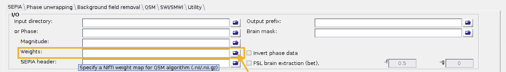

.. _weightings-in-sepia:

Weightings in SEPIA
===================

How does SEPIA compute the weights for dipole field inversion algorithms?
-------------------------------------------------------------------------

SEPIA utilises the inverse of the fieldmap standard deviation map (noisesd.nii.gz) as the weights for potential dipole field inversion algorithms usage. Specifically, The following steps are applied:

Step 1
^^^^^^
Invert the fieldmap standard deviation and remove non-value entries (i.e., NaN & inf become 0)

.. math::
   weights = \frac{1}{fieldmapSD}
   :label: invertsd

Step 2
^^^^^^
Normalisation of the weights. To establish more comparable weights between subjects and between protocols, the weights are first normalised by the value defined as (median + 3IQR). Because of the fast R2* tissues (e.g., globus pallidus), the histogram of the weights is usually negatively skewed. The threshold of (median +3IQR) should capture most of the brain issue <= 1.

.. math::
   weights = \frac{weights}{median(weights(mask)) + 3\times IQR(weights(mask))}
   :label: normalise

Step 3
^^^^^^
To avoid the weights estimated from vaious echo combination methods and dataset having significant differences in magnitude overall, the median of the histogram of the weights is re-centred to 1.

.. math::
   weights = weights - median(weights(mask)) + 1
   :label: recentre

Step 4
^^^^^^
The last step is to reduce the extreme values on the right hand side of the histogram, which can introduce an overall weight offset between different echo combination methods if the dipole field inversion methods performs weight normalisation using the maximum value of the input data (e.g., FANSI). Since the weights (to be more precisely, the fieldmap standard deviation, noisesd.nii.gz) are commonly derived from the magnitude data, these extreme values often correspond to the fresh spins in the arteries and spatially sparse. To reduce the extreme values while preserving the smoothness of the weighting map, the weighting map is thresholded (threshold defined as median + 3IQR) and the extreme values are replaced by a 3x3x3 (voxel) box filtered copy:

.. math::
   weights(weights>threshold) = weights_{smooth}(weights>threshold)
   :label: replace

where

.. math::
   weights_{smooth} = smooth3(weight.*mask)
   :label: filter

And this is the final output of the weights. Since the median after normalisation will be less than 1. Therefore, the minimum value of the weights will not be equal to zero, roughly speaking, most gray matter and white matter could have weight ~1; globus pallidus, red nucleus and substantia nigra ~0.7-0.9; veneous structures ~0.3-0.6.

Further modulation on the weighting maps
----------------------------------------
It is possible to further adjust the weighting map in SEPIA if a "quantitative unwrapping method" is chosen (e.g., SEGUE, ROMEO & region growing). This can be done by checking the "Exclude voxels using residual" option and select "Weighting map" as the input to be applied. The residual here is the relative residual of fitting the multi-echo data with a mono-exponential model:

.. math::
   relative residual = \frac{\sum^{t} \lvert \hat{S}(TE) - S(TE) \rvert ^{2}}{\sum^{t} \lvert S(TE) \rvert ^{2}}
   :label: rr

where S(TE) is the acquired data with the phase subtracted from the 1st echo

.. math::
   S(TE) = S(TE)e^{-i \theta_{S(TE_1)} }
   :label: s

and S hat is the mono-exponential model signal with the phase subtracted from the 1st echo

.. math::
   \hat{S}(TE) = S_0e^{-TE \times R_{2}^{*} + i \times TE \times \omega}e^{-i \times TE_1 \times \omega} }
   :label: shat

This information can be brought to the weighting map using the following operations:

Step 1: Clipping
^^^^^^^^^^^^^^^^

.. math::
   relative residual weights(relative residual weights>thres) = thres
   :label: rrw1

Step 2: Weighting component from the relative residual
^^^^^^^^^^^^^^^^^^^^^^^^^^^^^^^^^^^^^^^^^^^^^^^^^^^^^^

.. math::
   relative residual weights = (thres - relative residual weights) / thres
   :label: rrw2

which has values between 0 and 1

Step 3: Applying the weights from relative residual on previusly derived weighting map
^^^^^^^^^^^^^^^^^^^^^^^^^^^^^^^^^^^^^^^^^^^^^^^^^^^^^^^^^^^^^^^^^^^^^^^^^^^^^^^^^^^^^^
.. math::
   weights = weights .* relative residual weights
   :label: wrr

Override SEPIA weighting method
-------------------------------
If you prefer to derive your own weighting map and use it in SEPIA instead of the default weighting method of SEPIA in the One-stop processing application, you can sepcify your own NIfTI file in the I/O panel, or put the weighting map with a string 'weights' in the filename (e.g., 'data001_weights.nii.gz') along with your phase and magnitude data if you select a directory that contains SEPIA default naming structure files as the input. In this case, no weighting map will be degenerated by the software.

.. warning::
   User-defined weighting map is not supported if you use BIDS directory as the input.

How does SEPIA compute the weights before v1?
---------------------------------------------

Before v1, SEPIA utilises also the inverse of the field map standard deviation map as the weights, but the normalisation is different and more primitive. 

Step 1
^^^^^^
Invert the fieldmap standard deviation and remove non-value entries (i.e., NaN & inf become 0)

.. math::
   weights = \frac{1}{fieldmapSD}
   :label: invertsd2

Step 2
^^^^^^
Normalisation of the weights. Normalisation is performed by simply using the maximum value in the data so that the range of the weights is between 0 and 1

.. math::
   weights(mask) = \frac{weights(mask)}{max(weights(mask))}
   :label: max

The potential issue with this approach is the maximum value relying on a single voxel so it could be subject to outliers and variations between dataset (e.g., different subjects or acquisition protocol can produce different maximum). As a results, there could be a global differences in terms of the magnitude of the weights between different datasets. If a dipole field inversion algorithm takes the weights for the processing, without further normalisation by the algorithms, the differences of the overall weights magnitude could impose additional regularisation differences between datasets (e.g., among subjects of the same study) even the same regularisation parameter is used across the entire study. 

.. warning::
    The medians of the weights of these two versions are in different range (before v1: less than 1 and around 0.3-0.4; v1: close to 1), meaning it may require adjusting the regularisation parameter to match regularisation effect between the two versions. Therefore, it is not recommended to mix software versions in a single study.

