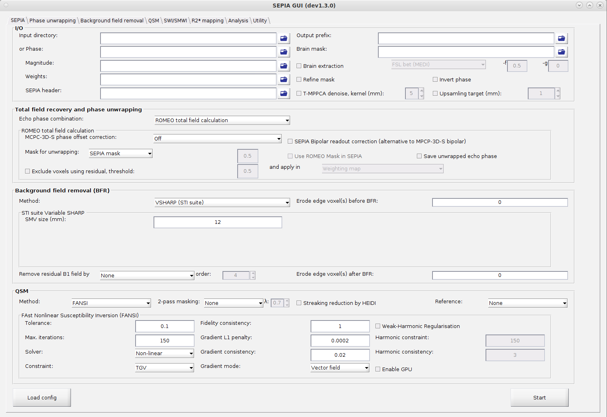
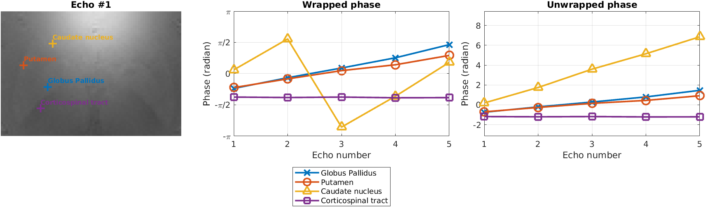

.. _sepia101-exercise2:

Exercise 2
==========

Objectives
----------

- Gaining experience in using SEPIA
- Understanding how to perform phase unwrapping

Data Required
^^^^^^^^^^^^^

+---------------------------------------------------------------------------+------------------------------------------------------------------------------------------------------------+
| Data                                                                      | Description                                                                                                |
+===========================================================================+============================================================================================================+
| ``<extracted_folder>/converted/SIEMENS/Monopolar/GRE/`` (raw BIDS folder) | 5 magnitude + 5 phase NIfTI files (one per echo) with JSON sidecars, as downloaded from the Zenodo archive |
+---------------------------------------------------------------------------+------------------------------------------------------------------------------------------------------------+

.. note:: Unlike Exercise 1, no mask or SEPIA header is needed upfront here either - SEPIA generates both automatically from the raw BIDS folder as part of this exercise (see below). 

Estimated time
^^^^^^^^^^^^^^

About 20 min.

SEPIA
-----

Now, go to the data directory in the Matlab's command window and start sepia:

``cd <extracted_folder>/converted/SIEMENS/Monopolar/GRE/``

``sepia;``

A graphical user interface (GUI) should appear right away. 

There are several tabs in SEPIA corresponding to usage of SEPIA in various tasks. The first tab in SEPIA provides a one-step application to process QSM from the raw phase data to a magnetic susceptibility map. Alternatively, we can break down the processing pipeline into several steps and SEPIA also supports this approach. 

In the following exercises, we will go for the second approach in this tutorial such that we can explain the QSM processing step by step.

Phase Unwrapping and Total Field Computation
^^^^^^^^^^^^^^^^^^^^^^^^^^^^^^^^^^^^^^^^^^^^

From exercise 1, we understand the raw phase GRE data is affected by the phase wrapping issue which stops us from computing the frequency shift correctly using the phase data.

In Exercise 1 you already used the pre-combined magnitude/phase NIfTI files for a quick look at the data. From here on, we are going to process the data the way you would with your own raw scanner output: directly from the **raw BIDS-formatted files** (separate NIfTI + JSON per echo), letting SEPIA combine the echoes and work out the acquisition header for you.

Downloading the raw BIDS data
^^^^^^^^^^^^^^^^^^^^^^^^^^^^^^

From the same extracted Zenodo archive you used in Exercise 1 (`<https://doi.org/10.5281/zenodo.7795492>`_), locate the folder ``<extracted_folder>/converted/SIEMENS/Monopolar/GRE/``. It contains 5 magnitude and 5 phase NIfTI files (one per echo) plus their JSON sidecars - this is the raw, BIDS-formatted output of the scanner's DICOM-to-NIfTI conversion, with no SEPIA-specific pre-processing applied. You can work directly from this folder - there is no need to copy or move it.

To correct the wrapped phase in the raw images, go the **Phase unwrapping** tab (next to **SEPIA** tab).

You will see two panels under the tab: the **I/O** panel is for specifying data input and output and the **Total field recovery and phase unwrapping** panel is for selecting phase unwrapping and true phase estimation algorithms.

.. tip:: SEPIA supports two data input routines: (1) If your data follows the SEPIA naming structure **or** the BIDS convention, you can select the directory containing all the input data as your input in the first row of **I/O** panel - SEPIA will auto-detect the format and, for BIDS input, automatically combine the individual echoes into a single 4D volume for you. (2) Alternatively, you can specify the input files separately by following the instruction of the second row of the **I/O** panel.

In the **I/O** panel:

#. Select the **Input directory**: *<extracted_folder>/converted/SIEMENS/Monopolar/GRE/*
#. Change the **Output prefix** to: *<extracted_folder>/converted/SIEMENS/Monopolar/GRE/output_unwrap/Sepia*
#. Right now we don't have any brain mask so leave the **Brain mask** field blank, check the **Brain extraction** checkbox, and set its method to 'FSL bet (MEDI)'.

   .. image:: images/exercise2_phase_unwrap_io.png

In the **Total field recovery and phase unwrapping** panel: 

#. Keep the **Echo phase combination** method as 'Optimum weights'. 

   This option is to determine how the phase information in time will be combined for multi-echo data. Here we decided to combined the phase information based on SNR weighting. 

#. Change the **Phase unwrapping** method to 'SEGUE'. 

   This option is to determine the algorithm to spatially unwrap the phase. 'SEGUE' is a region growing based method.

#. Check **Exlcude voxels using residual, threshold:** option. 

   This optino allows us to create a new weighting map based on how closely the signal evolves like a simple linear model. 

#. Check **Save unwrapped echo phase** option. 

   This option allows us to save the unwrapped phase for each echo.

   .. image:: images/exercise2_phase_unwrap_algorithm.png
      :align: center

Then click the **Start** button at the bottom of the GUI.

You should now see some messages regarding the general information of your input data and the overview of the selected method(s) displaying on the Matlab's command window. Once the process finishes (a few minutes), you will see the message meaning the processing is finished.

'*Processing pipeline is completed!*'. 

.. tip:: All the output messages of SEPIA will be displayed on the Matlab command window. Make sure you check the command window before clicking the **Start** button again!

Once the process is finished, you should be able to see the following output in the output directory (*<extracted_folder>/converted/SIEMENS/Monopolar/GRE/output_unwrap/*)

+------------------------------------------+-----------------------------------------------------------------------------------------------------------------------+
| Output data                              | Description                                                                                                           |
+==========================================+=======================================================================================================================+
| *sepia_config<timestamp>.m*              | Automatically generated script by the GUI of SEPIA containing all user specified parameters                           |
+------------------------------------------+-----------------------------------------------------------------------------------------------------------------------+
| *sepia_config<timestamp>.log<timestamp>* | Event log file of the Matlab's command window output                                                                  |
+------------------------------------------+-----------------------------------------------------------------------------------------------------------------------+
| *dataset_description.json*               | Minimal BIDS-Derivatives dataset description, written once at the root of the output directory                        |
+------------------------------------------+-----------------------------------------------------------------------------------------------------------------------+
| *Sepia_header.mat*                       | SEPIA header automatically generated from the BIDS NIfTI/JSON files (echo times, field strength, etc.)                |
+------------------------------------------+-----------------------------------------------------------------------------------------------------------------------+
| *Sepia_part-mag.nii.gz*                  | Combined multi-echo magnitude data, compiled from the individual raw BIDS echo files                                  |
+------------------------------------------+-----------------------------------------------------------------------------------------------------------------------+
| *Sepia_part-phase.nii.gz*                | Combined multi-echo (wrapped) phase data, compiled from the individual raw BIDS echo files                            |
+------------------------------------------+-----------------------------------------------------------------------------------------------------------------------+
| *Sepia_mask_brain.nii.gz*                | Brain mask automatically generated using FSL bet (MEDI), since none was provided                                      |
+------------------------------------------+-----------------------------------------------------------------------------------------------------------------------+
| *Sepia_fieldmap.nii.gz*                  | Unwrapped total frequency shift in Hz                                                                                 |
+------------------------------------------+-----------------------------------------------------------------------------------------------------------------------+
| *Sepia_relativeresidual.nii.gz*          | Relative residual derived using mono-exponential model with a single frequency shift (if voxel exclusion is selected) |
+------------------------------------------+-----------------------------------------------------------------------------------------------------------------------+
| *Sepia_relativeresidualweights.nii.gz*   | Weighting map [0,1] derived from thresholding the relative-residual map                                               |
+------------------------------------------+-----------------------------------------------------------------------------------------------------------------------+
| *Sepia_mask_reliable.nii.gz*             | Derived from thresholding relative-residual map using user-defined value                                              |
+------------------------------------------+-----------------------------------------------------------------------------------------------------------------------+
| *Sepia_mask_localfield.nii.gz*           | Signal mask for the background field removal step in the next exercise                                                |
+------------------------------------------+-----------------------------------------------------------------------------------------------------------------------+
| *Sepia_noisesd.nii.gz*                   | Estimated standard deviation of noise in the phase data                                                               |
+------------------------------------------+-----------------------------------------------------------------------------------------------------------------------+
| *Sepia_part-phase_desc-unwrapped.nii.gz* | Unwrapped phase data in radian                                                                                        |
+------------------------------------------+-----------------------------------------------------------------------------------------------------------------------+
| *Sepia_weights.nii.gz*                   | SNR-weighted image derived from standard deviation of noise in phase data                                             |
+------------------------------------------+-----------------------------------------------------------------------------------------------------------------------+

*sepia_config<timestamp>.m* is worth a special mention: it is not just a record of what you did - it is the actual script that SEPIA's GUI generates from your selections in the **I/O** and algorithm panels, and then runs to perform the processing. In other words, the GUI is a front-end that writes this config script for you and executes it; the config script itself is what drives SEPIA's processing backend. This means you can also open it, inspect it, tweak it directly, or re-run it later (e.g. ``run('output_unwrap/sepia_config<timestamp>.m')`` in Matlab, replacing ``<timestamp>`` with the actual value) without needing to go through the GUI again.

.. note:: Most of the NIfTI outputs above also come with a same-named ``.json`` sidecar (units, source files, algorithm parameters used) - feel free to peek at e.g. ``Sepia_fieldmap.json``.

Let's have a look of the unwrapped phase first (*Sepia_part-phase_desc-unwrapped.nii.gz*), assuming you are still in the data directory (*<extracted_folder>/converted/SIEMENS/Monopolar/GRE/*) in Matlab.

``view_nii(load_nii('output_unwrap/Sepia_part-phase_desc-unwrapped.nii.gz'))``

Try to see the phase of each echoes using the slider of 'Scan ID'. Now you shall see that all the zebra-line pattern and phase jumps are gone in the later echo images. If we plot the phase of the brain structure in Exercise 1, the phase of the caudate nucleus also evolves linearly after phase unwrapping.

With the correctly unwrapped phase, we can compute the total frequency shift (*Sepia_fieldmap.nii.gz*) in the tissue from the phase using the following equation:

.. math::
   frequency = \frac{phase}{time}
   :label: fpt

Open the total frequency shift (or field) map and see how it looks like:

``view_nii(load_nii('output_unwrap/Sepia_fieldmap.nii.gz'))``

In the total field map, we can vaguely see some brain structures but they seems to be hidding behind something. It is because the total field map has contributions from not only the tissues but also background sources such as air/tissue interface which have strong magnetic susceptibility creating magnetic fields that can affect the whole brain. To be able to compute tissue magnetic susceptibility, the field effect from background (non-tissue) sources has to be removed from the total field.

You can close the image viewer now.

Proceed to :ref:`sepia101-exercise3`.

Back to :ref:`sepia101-exercise1`.
