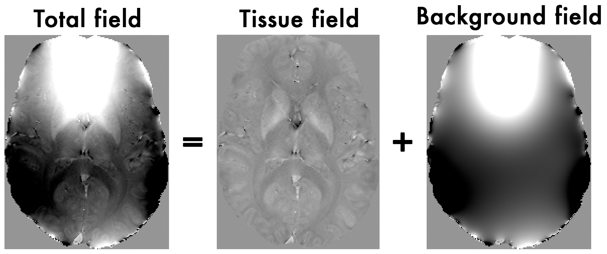
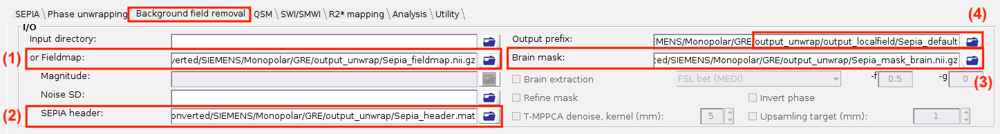
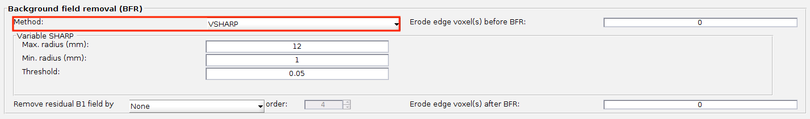

.. _sepia101-exercise3:
.. role::  raw-html(raw)
    :format: html

Exercise 3
==========

Objectives
----------

- Understanding why we need to remove the background magnetic field contributions before QSM  
- Fine-tuning method parameters to improve the background field removal results

Data Required
^^^^^^^^^^^^^

+---------------------------+---------------------------------------------------------------------------------------------------------------+
| Data                      | Description                                                                                                   |
+===========================+===============================================================================================================+
| *Sepia_fieldmap.nii.gz*   | Unwrapped total frequency shift in Hz, in *<extracted_folder>/converted/SIEMENS/Monopolar/GRE/output_unwrap/* |
+---------------------------+---------------------------------------------------------------------------------------------------------------+
| *Sepia_mask_brain.nii.gz* | 3D signal mask, in *<extracted_folder>/converted/SIEMENS/Monopolar/GRE/output_unwrap/*                        |
+---------------------------+---------------------------------------------------------------------------------------------------------------+
| *Sepia_header.mat*        | contains important information such as the echo times (TE) and magnetic field strength (in Tesla), and        |
|                           | orientation of the acquisition regarding the physical coordinates of the scanner. These are important         |
|                           | to compute the magnetic susceptibility with the correct units and ensure the physical model is correct        |
|                           | , in *<extracted_folder>/converted/SIEMENS/Monopolar/GRE/output_unwrap/*                                      |
+---------------------------+---------------------------------------------------------------------------------------------------------------+

Estimated time
^^^^^^^^^^^^^^

About 10 min.

Background Field Removal  
------------------------

The total frequency map we obtained from the last exercise contains magnetic fields generated by not only the brain tissue but also the scanner hardware imperfection and fields generated at air/tissue interfaces. Therefore, we have to remove the non-tissue field contributions, or background field, before computing the susceptibility map.

.. toctree::
   :maxdepth: 1

   Theory_backgroundfieldremoval

   
   Figure 1: The total field we obtained from the last exercise is the summation of tissue and background magnetic fields. In order to compute the magnetic susceptibility of the brain tissue correctly, the background field contributions have to be removed before mapping the tissue susceptibilities.

SEPIA provides 7 methods to remove the background magnetic fields. Today we will use the so-called Variable-kernel Sophisticated Harmonic Artifact Reduction for Phase (V-SHARP) algorithm to do this job.

Exercise 3.1
^^^^^^^^^^^^

Go to the **Background field removal** tab. You will see two panels as in the **Phase unwrapping** tab. 

In the **I/O** panel, specify the required files by using the |open| buttons:

#. **or Total field**: *Sepia_fieldmap.nii.gz* (in *<extracted_folder>/converted/SIEMENS/Monopolar/GRE/output_unwrap/*),
#. **SEPIA Header**: *Sepia_header.mat* (in *<extracted_folder>/converted/SIEMENS/Monopolar/GRE/output_unwrap/*),
#. **Brain mask** *Sepia_mask_brain.nii.gz* (in *<extracted_folder>/converted/SIEMENS/Monopolar/GRE/output_unwrap/*),
#. Change the **Output prefix** to: *<extracted_folder>/converted/SIEMENS/Monopolar/GRE/output_unwrap/output_localfield/Sepia_default*

Second, in the **Background field removal** panel, change the **Method** to 'VSHARP'. You can have three parameters to adjust. 

- 'Max. radius (mm)': the largest radius of the spherical mean value (SMV) kernel used, in mm
- 'Min. radius (mm)': the smallest radius of the SMV kernel used, in mm - VSHARP progressively shrinks the kernel radius from Max. down to Min. (voxel by voxel) so that fewer edge voxels need to be discarded than with a single fixed-radius SMV kernel
- 'Threshold': threshold used in the k-space deconvolution (Truncated SVD)

1. Press the **Start** button. 

   Again, when the process is finished, you will see the message:
   '*Processing pipeline is completed!*'. 

2. Once the process is finished, you should be able to see the following output in the output directory (*<extracted_folder>/converted/SIEMENS/Monopolar/GRE/output_unwrap/output_localfield/*)

   +-----------------------------------+-------------------------------------------------------------------------------------------+
   | Output data                       | Description                                                                               |
   +===================================+===========================================================================================+
   | *sepia_config.m*                  | Automatic generated script by the GUI of SEPIA containing all user specified parameters   |
   +-----------------------------------+-------------------------------------------------------------------------------------------+
   | *run_sepia.log*                   | Event log file of the Matlab's command window output                                      |
   +-----------------------------------+-------------------------------------------------------------------------------------------+
   | *Sepia_default_localfield.nii.gz* | Local (tissue) field map in Hz                                                            |
   +-----------------------------------+-------------------------------------------------------------------------------------------+
   | *Sepia_default_mask_QSM.nii.gz*   | Signal mask for QSM step                                                                  |
   +-----------------------------------+-------------------------------------------------------------------------------------------+ 
   
   Open the local field map with any NIfTI image view (e.g. ``FSLeyes`` or ``mricron``). Adjust the display window to 'Min -7' and 'Max 7'.

   Note you can clearly see the contrast between grey and white matter, and veins and tissue now. Other structures as the globus pallidus, red nuclei and substantia nigra are visible… but not quite normal.

   .. image:: images/exercise3_localfield.png
      :align: center

3. The figure below shows the last echo of magnitude data,  where the globus pallidus is circled by red line, based on the image intensity, and the corresponding local field map. It is known that globus pallidus has a high iron content which can generate a strong induced magnetic field.

   **Can you guess the shape and sign of the magnetic properties of the globus palllidus?**

   .. image:: images/exercise3_gp_location.png
      :align: center

You can close all the NIfTI viewers now.

Proceed to :ref:`sepia101-exercise4`.

Exercise 3.2 (Advanced)
^^^^^^^^^^^^^^^^^^^^^^^

.. note:: If you still have enough time, follow the exercise below.

In this exercise, we will focus on the effect of using a different 'Min. radius (mm)' value.

#. Change the **Output prefix** to: *<extracted_folder>/converted/SIEMENS/Monopolar/GRE/output_unwrap/output_localfield/Sepia_rmin-3*

#. Change the **Min. radius (mm)** in the **Background field removal** panel to: 3

   .. image:: images/exercise3_rmin3.png
      :align: center

#. Press the **Start** button. Again, when the process is finished, you will see the message:
   '*Processing pipeline is completed!*'. 

#. Try open *Sepia_rmin-3_localfield.nii.gz* and *Sepia_default_localfield.nii.gz* at the same time. Adjust the display window to 'Min -7' and 'Max 7' for both images. What differences can you see between the two results?

Proceed to :ref:`sepia101-exercise4`.

Back to :ref:`sepia101-exercise2`.

     
