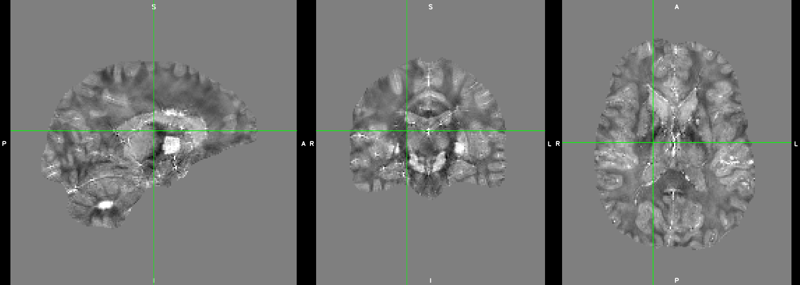

.. _sepia101-exercise4-answer-2:

Answer: Exercise 4.2  
====================

You should now see some brain structures in the QSM map. 

The idea of the TKD method is very straightforward. Since we know the location in which the division results are unreliable (i.e. when D equal/close to zero), we can discard the information in these regions by replacing their values to zero after the element-wise division.

For example, without thresholding the QSM k-space:

.. image:: images/qsm_fourier_tkd-0.png

and we can threshold the above k-space when the magnitude of D is smaller than, e.g. 0.15, leading to 

.. image:: images/qsm_fourier_tkd-0p15.png

The Fourier transform of the above image is the QSM map we obtained in this exercise.

.. tip:: However, the larger is the threshold value, the more is the information being discarded. Therefore, increasing the threshold can improve the appearance of the resulting QSM map (as artefacts reduced), we are also losing the accuracy between our input (i.e. local field map) and output (i.e. QSM map).

Back to :ref:`sepia101-exercise4`.