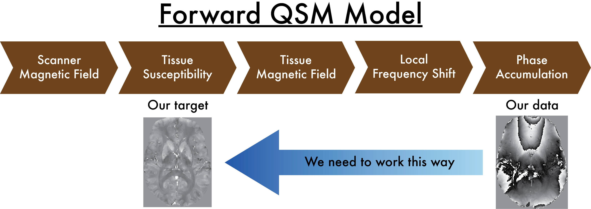

.. _SEPIA101-index:

SEPIA 101 - First QSM with SEPIA
================================

Objectives
----------

- Understanding the background of magnetic susceptibility contrast
- Gaining experience in basic QSM post-processing in SEPIA framework

Target Audience
^^^^^^^^^^^^^^^

- who is new to SEPIA
- who wants to know some basic knowledge about QSM

Estimated Time
^^^^^^^^^^^^^^

About 1 hour

Prerequisite
------------

Please install SEPIA in the Matlab environment. You can find the information about the installation procedures in :ref:`gettingstart-installation`.

Data Required
-------------

This tutorial uses the **QSM Consensus Paper Example Data** (Chan, Marques, Spincemaille and Wang), publicly available on Zenodo at `<https://doi.org/10.5281/zenodo.7795492>`_ under a `CC-BY-4.0 <https://creativecommons.org/licenses/by/4.0/>`_ license - specifically, the SIEMENS Monopolar GRE acquisition from that dataset: a real (in-vivo) 5-echo monopolar 3D GRE brain scan acquired at 3T. If you use this data (e.g. in a publication or teaching material), please cite the dataset via its DOI above.

Detailed, step-by-step download instructions are given at the start of :ref:`sepia101-exercise1` and :ref:`sepia101-exercise2` (the tutorial uses two different views of the same acquisition: a pre-combined 4D magnitude/phase pair for the initial data-inspection exercise, and the raw BIDS-formatted per-echo files for the actual SEPIA processing exercises).

Introduction
------------

In this tutorial, we will go through the standard processing pipeline for quantitative susceptibility mapping (QSM), a novel contrast mechanism that uses to study tissue magnetic properties, in SEPIA framework. 

.. toctree::
   :maxdepth: 1

   Theory_qsmphysics

   
   Figure 1: QSM theory. A magnetic source generates a secondary magnetic field inside the MRI scanner, which will eventually alter the signal phase we measured. Decoding the phase data allows us to detect the molecular environment of the brain tissues.  

Exercises
---------

Let's begin with the following exercises that will take you from the phase data to the susceptibility maps!

.. toctree::
   :maxdepth: 1
   :name: toc-tutorial-sepia101

   Exercise1
   Exercise2
   Exercise3
   Exercise4
   
