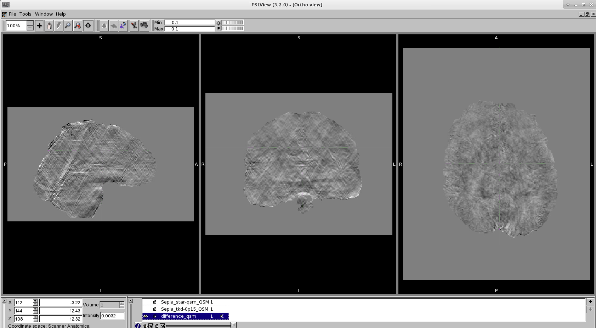

.. _fmritoolkit2019-exercise4-answer-3:

Answer: Exercise 4.3  
====================

You should be able to see the QSM map produced by Star-QSM is less noisy compared to the TKD result. 

When looking to the difference map (see below), you can see that the main difference is the so-called more pronounced streaking artefact present in the TKD QSM map (which can be identified in the sagittal and coronal views).

Back to :ref:`fmritoolkit2019-exercise4`.