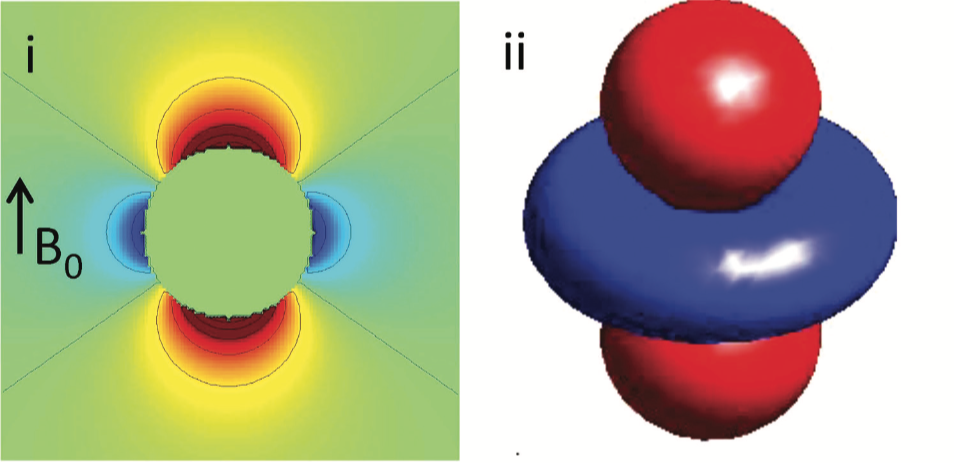

.. _fmritoolkit2019-theory-dipoleinversion:

Theory: Dipole Inversion
========================

When looking at the local-field you can see some beautiful contrasts between brain tissues. These local fields represent all the secondary magnetic field induced by the tissues (which are our magnetic susceptibility sources). The tissue is suddenly behaving like a small magnet and the effect of the magnetic field extends beyond the source itself. 

.. note:: Think of a magnet that can attract a metal towards it even when the two objects are not intact. It is because the magnetic field generated by the magnet extends outside the magnet body itself.

The local fields generated by the magnetic susceptibility sources (:math:`\chi`), can be computed using the following equation:

.. math:: 
   Tissue field = \chi * d
   :label: fcd

where :math:`d` is a unit (dipole) field that the source generated and has the following shape:

   Figure 1: An illustration of a unit dipole field in (i) sagittal section and (ii) surface rendered contour. Red colour represents a positive magnetic field and blue colour represents a negative magnetic field. (Reproduced from `Wang & Liu MRM 2014, Wiley <https://doi.org/10.1002/mrm.25358>`_)

Eq. :eq:`fcd` basically means that the secondary magnetic field experienced by the tissue at each location is the summation of the fields generated by all other (surrounding) sources. Since we have the prior knowledge about the shape of the magnetic field generated by a unit source (which is :math:`d` , the unit dipole field) and the field generated by the tissues (output of exercise 3, *local-field.nii.gz*), mapping the magnetic susceptibility of the tissue is just the deconvolution of these two spatial maps (a.k.a. dipole inversion).

Back to :ref:`fmritoolkit2019-exercise4`.
